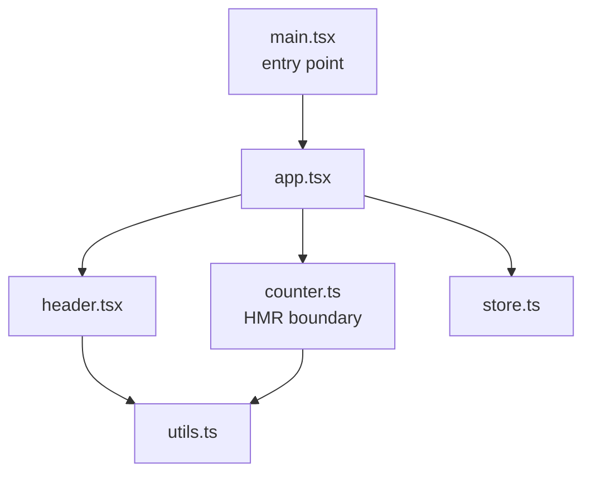
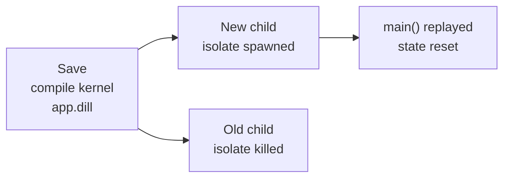
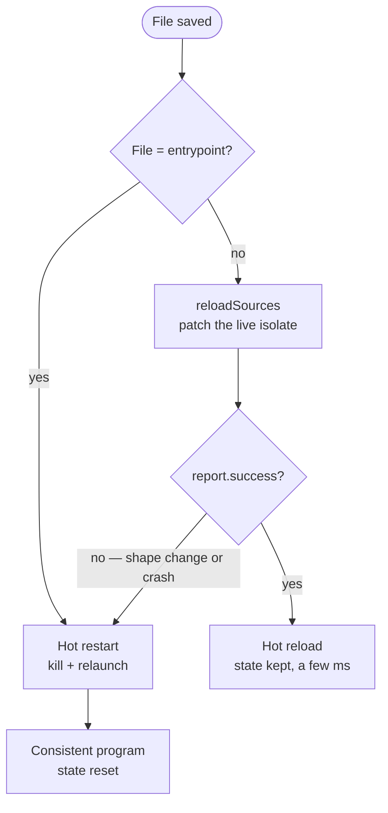

## What is an HMR

> **HMR** stands for *Hot Module Replacement*. It means replacing units of code in a program that's **already running**, without restarting it, and ideally without losing its in-memory state.

The idea was born on the web, first designed for the frontend. But the need itself is universal: shorten the loop between "I change a line" and "I see the result" as much as possible.

To place the term properly, it helps to separate three gestures we often confuse:

- **Cold reload**: you stop everything and restart the program by hand. No help at all, the bare minimum.
- **Hot restart**: a supervisor automatically relaunches the app with the updated code on every save. The feedback loop is instant, but **state starts from scratch**: `main()` runs again from the top.
- **Hot reload**: the modified code is injected into the running program. Global variables, open connections, everything is kept. **Only the code changes.**

All three are essential, and good tooling often offers the last two side by side. The whole point of an HMR is to push the cursor as far toward hot reload as possible, while keeping a safety net for when it doesn't apply.

---

## A DX popularized by Vite and Flutter

If saving and seeing the result instantly, without losing the app's current state, has become a default expectation, it's largely thanks to two tools from opposite ecosystems.

On the web, **ViteJS** made module reloading almost instant, whatever the size, weight, or complexity of the project. You watch your code changes (React, Vue…) reflected in real time, without ever reloading the page.

In the Dart ecosystem, the **Flutter** core team built equivalent tooling, tailored to its own framework.

Hot reload became second nature there.

We change a widget, the screen updates immediately, and above all **the app's state is preserved**.

The premise is simple: we stay on the same screen, with the same data in memory, the same scroll position, the same filled-in fields. No more redoing the whole journey to get back to where we were.

These two worlds, opposite on the surface, actually chase the same promise developers expect: faster development and better productivity.

That expectation eventually spilled past its original scope. The moment you build an application in **pure Dart**, an HTTP server, a worker, a command-line tool, any project outside Flutter, this convenience simply didn't exist. You fell back to the classic routine, the cold reload one: stop, relaunch, wait, start over.

> Bring iterative development to every Dart application, not just the ones built with Flutter.

That gap is exactly what pushed me to create [HMR](https://pub.dev/packages/hmr).

---

## How ViteJS works

Understanding how ViteJS works sheds light on everything that follows; I clearly based the project's design on it.

During development, unlike older alternatives, ViteJS doesn't *bundle* the application.

The classic approach (webpack and the like) starts by **assembling every file into one big bundle** before it can serve anything; the bigger the project grows, the longer that step takes.
ViteJS pre-assembles nothing. It just consumes each source file as-is, as a plain **native ES module (ESM)**, then lets the browser request them **on demand**, following the `import` statements it encounters.

To orchestrate all this machinery, ViteJS keeps a **module graph** up to date, a mental map of "who imports whom". The simplest way to picture it is as a dependency tree, rooted at the entry point and branching out to each imported file.



Each node is a module, each arrow is an `import`. It's exactly this map that makes targeted updates possible: starting from the file that just changed, then walking up and propagating the changes to the modules that depend on it. ViteJS knows instantly who depends on what at any given moment, and therefore which segments to re-evaluate, all without touching the rest of the tree.

When a file changes, ViteJS doesn't rebuild the bundle. It looks at the graph, computes the **shortest chain** between the modified file and the nearest *HMR boundary*, then pushes a targeted update to the browser **over a WebSocket connection**.

An HMR boundary is a module that "accepts" itself:

```ts [cart.ts]
interface CartState {
  items: string[]
  total: number
}

// Module-local state: restored from the previous version if one exists,
// otherwise initialized empty.
const cart: CartState = import.meta.hot?.data.cart ?? { items: [], total: 0 }

const totalLabel = document.querySelector<HTMLSpanElement>('#total')!

export function addItem(name: string, price: number): void {
  cart.items.push(name)
  cart.total += price
  totalLabel.textContent = `${cart.total} €`
}

if (import.meta.hot) {
  // The module accepts itself: Vite swaps its code in place,
  // without reloading the whole page.
  import.meta.hot.accept()

  // Before being replaced, it hands its state to the new version,
  // which reads it back at the top of the file. If the cart held 3 items,
  // it still holds them after the save — no emptied cart.
  import.meta.hot.dispose((data) => {
    data.cart = cart
  })
}
```

So only the module concerned (and the modules it depends on) is re-run, the rest of the app keeps running, and **state is preserved**. Since there's no rebundle step, update speed stays constant whether the project has ten files or ten thousand.

Two ingredients are worth remembering, because they're exactly the ones we'll need to find again in Dart:
1. a way to surgically replace a unit of code in a live system
2. a channel to push that update to the running program

---

## Isolates and hot restarting

My initial goal was clear: get that instant update loop back for any Dart application.

The right starting point, in pure Dart, is [`isolates`](https://dart.dev/language/isolates). An isolate is a self-contained execution unit with its own memory; we can run it from a compiled file and talk to it through messages. The isolate is the most direct primitive for running the app while keeping a handle on it.

From there came the first architecture, simple and robust: a **supervisor isolate** watches the files, the app runs in a **child isolate**.

On every save, the supervisor recompiles the entrypoint into a kernel snapshot, replaces the child, then relaunches it directly.
Worth noting: this recompilation step guarantees the code being run is valid and functional, but it also means a tiny delay before the new isolate is ready to receive messages.

```dart [main.dart]
// The runner owns the current child isolate and its message channel.

Future<void> main() async {
  Isolate? _isolate;
  ReceivePort? _receivePort;
  SendPort? _sendPort;

  // 1. Compile the entrypoint into a kernel snapshot (.dill)
  final result = await Process.run(
    'dart',
    ['compile', 'kernel', entrypoint.path, '-o', dillFile.path],
  );

  if (result.exitCode != 0) {
    // surface the compile error cleanly, then wait for the next save
    return;
  }

  // 2. Kill the child isolate the runner already owns.
  //    On the very first launch, _isolate is null: this kill is a no-op.
  _isolate?.kill(priority: Isolate.immediate);

  // 3. Replace it with an up-to-date version, then re-establish the message
  //    channel: the child sends back its SendPort as its first message.
  _receivePort = ReceivePort();
  _isolate = await Isolate.spawnUri(dillFile.uri, args, _receivePort!.sendPort);
  _sendPort = await _receivePort!.asBroadcastStream().first;
}
```



Let me be precise about what this implementation achieved, because it's both powerful and imperfect. It delivered a real **hot restarting**, automatic and reliable, without a single manual relaunch. Compile errors were caught and printed cleanly instead of crashing the session, and a `SendPort` / `ReceivePort` channel even let the supervisor and the app exchange messages.

In other words, it already held **the most important half of the DX**: the immediate restart loop.

This approach was the right first design, built on the primitives available. Flutter itself offers hot restart as a first-class gesture, on the `R` key. Its one limit, an accepted one, came straight from the same mechanism: since the child isolate is replaced every time, `main()` runs again and in-memory state starts from scratch.

The cache, the session, the counter, the open connection: everything is rebuilt on every save.

That was the starting point we needed: a solid base to graft the missing piece onto, **state preservation**.

The experience was already usable thanks to its zero-configuration setup.

```sh [Terminal]
dart pub global activate hmr
hmr
```

`hmr` watched `.dart` files, launched the entrypoint, and relaunched it on every save. An optional `hmr:` block in `pubspec.yaml` let you tune the behavior:

```yaml [pubspec.yaml]
hmr:
  entrypoint: bin/server.dart
  debounce: 50
  includes:
    - "**/*.dart"
  excludes:
    - "test/**"
```

And for apps that wanted to talk to the supervisor, the message channel was exposed directly:

```dart [main.dart]
import 'package:hmr/hmr.dart';

void main() {
  final runner = Runner(
    tempDirectory: Directory.systemTemp,
    entrypoint: File(
      path.join([
        Directory.current.path,
        'bin',
        'main.dart'
      ])
    ));

  final watcher = Watcher(
    onStart: () => print('Watching for changes...'),
    middlewares: [
      IgnoreMiddleware(['~', '.dart_tool', '.git', '.idea', '.vscode']),
      DebounceMiddleware(Duration(milliseconds: 5), dateTime),
      IncludeMiddleware([Glob("**.dart")]),
    ],
    onFileChange: (int eventType, File file) async {
      final action = switch (eventType) {
        FileSystemEvent.create => 'created',
        FileSystemEvent.modify => 'modified',
        FileSystemEvent.delete => 'deleted',
        FileSystemEvent.move => 'moved',
        _ => 'changed'
      };

      print('File $action ${file.path}');
      await runner.reload();
    });

  watcher.watch();
  runner.run();
}
```

For the 80/20 of use cases, this was enough: for a server you simply want to see restart cleanly on every save, the promise holds.

---

## Dart and vm_service

Now it was time for the project to climb the last step of this journey: state preserved across restarts.

Fundamentally, we had to keep the persistent state in our main, inside the parent isolate, which only dies when the program ends.

To break free of that constraint, we needed to change our approach, and it had been right in front of me from the start: the **Dart VM** itself, driven through the [`vm_service`](https://pub.dev/packages/vm_service) package.

Any Dart application can be launched with a service server enabled (`--enable-vm-service`). Over an RPC protocol, this service exposes operations on the running VM, and **`reloadSources`** in particular. That operation asks the VM to **patch the code of a live isolate**: it recompiles only what changed, swaps function bodies and class definitions in the running isolate, and lets it keep going. The isolate doesn't die. Its state stays intact.

This isn't some exotic detour: **it's exactly the primitive Flutter's hot reload is built on.** When you press `r` in the terminal after running `flutter run`, the tool sends a `reloadSources` to the app's VM service. The low-level mechanism is identical for a Dart server and for Flutter.

So the new architecture launches the application as a **real child process** (no longer an internal isolate) with the VM service enabled, connects to it, then on every save issues a `reloadSources` on the live isolate, landing us exactly where we wanted to be.

```dart [vm_service_process_strategy.dart]
Future<ReloadOutcome> _doReload(String trigger, FsEvent? fileEvent) async {
  // Patch the code in the LIVE isolate, via the VM service
  final report = await service.reloadSources(isolateId, force: true);

  if (report.success ?? false) {
    // In-memory state kept, code up to date. A few milliseconds.
    return ReloadOutcome.ok;
  }

  // The VM can't reconcile this change → fall back to a full restart
  await _killProcess();
  await _launch();

  return ReloadOutcome.fallbackUsed;
}
```

But preserving state isn't always possible, or even desirable. Two situations call for deliberately falling back to the hot restart inherited from the first implementation:

- **Entrypoint change**: a hot reload reloads the *code* of `main()`, but **never replays it**. If your initialization changes, a route added at startup, a dependency imported in `main()`, or any content change would stay invisible. So we force a restart whenever the modified file *is* the entrypoint.
- **Fatal error or shape change**: if the app has crashed, or the change alters the *shape* of the program in a way the VM can't reconcile (adding an instance field, changing a class hierarchy…), `reloadSources` fails. Rather than sit in an inconsistent state, we switch to a full restart of the application.

---

## The hybrid model

So the current version doesn't replace hot restart with hot reload: it **combines both approaches** under a hybrid model.

Hot reload becomes the default path; the hot restart from the first implementation becomes the safety net, triggered automatically when hot reloading doesn't apply. It's the exact trade-off Flutter offers: hot reload whenever it's possible, then hot restart if it has to, without the user ever having to choose.

::::step-group
  :::step{title="A file changes"}
    The watcher emits a filtered event (include/exclude globs, debounce).
    ```dart [main.dart]
    final orchestrator = ReloadOrchestrator(
      strategy: strategy,
      watcher: FileWatcher(Directory.current), // 👈 Watch for file changes
      debounce: const Duration(milliseconds: 50),
      filters: [
        ignoreSegment(const ['.git', '.dart_tool']),
        includeGlobs([Glob(path.join(root, '**.dart'))]),
      ],
    );
    ```
  :::
  :::step{title="Is it the entrypoint?"}
    If so, immediate full restart — `main()` has to be replayed. We don't attempt a hot reload.
  :::
  :::step{title="Otherwise, try a hot reload"}
    `reloadSources` patches the live isolate. On success: done, state kept, in a few milliseconds.
  :::
  :::step{title="VM refuses, or the app crashed?"}
    Automatic fallback to a full restart. The program always stays consistent, the user has nothing to do.
  :::
::::

Whatever case we hit, we always land on a consistent state of our application: state is preserved when the hot reload succeeds, and cleanly rebuilt when a restart is needed.



Side by side, the two versions answer each other point for point:

| | First implementation | New version (hybrid) |
|---|---|---|
| Execution model | child isolate inside the supervisor | independent child process (`--enable-vm-service`) |
| Default gesture on save | restart the isolate | hot reload on the live isolate |
| In-memory state | rebuilt on every save | kept on a hot reload |
| Recompilation | kernel snapshot, in a subprocess | incremental, inside the VM |
| Perceived latency | fast | near-instant |
| Restart fallback | it was the only mode | automatic on entrypoint / shape change / crash |

> Yesterday's only mode became today's safety net.

Nothing was thrown away: the first brick found its rightful place in a more complete whole.

### Zero-config usage

For zero-configuration usage, nothing changes — it's still `hmr` from the project root. The new part shows up when the application wants to **react** to reloads.

The developer can then listen to the events `hmr` emits: import the runtime API and subscribe to typed events.

```dart [main.dart]
import 'package:hmr/runtime.dart';

void main(List<String> args) {
  Hmr.instance.init();

  // The code was patched in place, state is intact:
  // a good moment to re-register handlers, invalidate a cache…
  Hmr.instance.onReload((_) => print('Hot reload — state preserved'));

  // Full restart: we start over, then re-bootstrap what's needed
  Hmr.instance.onRestart((_) => print('Hot restart — re-bootstrapping'));

  // The file was modified: we can re-apply the changes
  Hmr.instance.onFileModified((change) => print('Saved: ${change.path}'));

  // ... your application starts here
}
```

### The detail that matters

The `runtime` API is a **no-op** outside the supervisor (detected through an environment variable). The same `main()` therefore works identically under `hmr` and under a plain `dart run`, with no conditional imports and no build flags. That keeps behavior consistent and identical between development and production.

### Compose your own runner

When the default implementation isn't enough, or you want custom behavior, the library exposes all its building blocks so you can **compose your own runner**:

```dart [custom_hmr.dart — excerpt]
Future<void> main(List<String> args) async {
  final root = Directory.current.path;

  final strategy = VmServiceProcessStrategy(
    entrypoint: File(path.join(root, 'bin', 'main.dart')),
    args: args,
  );

  final orchestrator = ReloadOrchestrator(
    strategy: strategy,
    watcher: FileWatcher(root),
    debounce: const Duration(milliseconds: 50),
    filters: [
      ignoreSegment(const ['.git', '.dart_tool']),
      includeGlobs([Glob(path.join(root, '**.dart'))]),
    ],
  );

  // Bring your own presenter, or use AnsiPresenter / JsonPresenter.
  final presenter = AnsiPresenter()
    ..attach(orchestrator.events);

  ProcessSignal.sigint.watch().listen((_) async {
    await orchestrator.stop();
    await presenter.dispose();

    exit(0);
  });

  await orchestrator.start();
}
```

Each piece of this example is an independent, swappable brick, exactly the ones the built-in CLI assembles for you:

- **`VmServiceProcessStrategy`** launches the entrypoint as a child process and drives the VM service, the heart of hot reload. Implementing `RunStrategy` lets you replace it entirely.
- **`FileWatcher`** watches the file tree and emits a stream of file events.
- **The filters** (`ignoreSegment`, `includeGlobs`, `excludeGlobs`) decide which changes actually trigger a reload.
- **The presenter** (`AnsiPresenter`, `JsonPresenter`, or your own) turns the stream of typed events into output: readable terminal, pipeable JSON, or any other format.
- **`ReloadOrchestrator`** wires it all together — strategy, watcher, filters, and debounce — and exposes `start` / `stop` / `reload` / `restart`.

The same foundation powers all three usages, in one piece:
- `hmr` with zero configuration
- the runtime API to react to events
- the custom runner when you want full control

Nothing is hidden behind the binary: whatever `hmr` does by default, you can recompose it piece by piece.

---

## Flow and greater productivity

Beyond the mechanism, what really counts is what it means for the developer working on their code, save after save, all day long.

The first implementation had already solved the most visible part, the immediate restart loop, with no manual relaunch. The gain specific to the hybrid version plays out elsewhere, on a quieter but often more expensive cost: **getting back to the state you were working in.**

Take a genuinely *stateful* application: a server with open sessions, a worker in the middle of a queue, a multi-step interactive CLI. When state starts from scratch on every save, you have to rebuild it by hand before you can even see the effect of your change, reconnect, re-navigate to the right request, refill the form, rewarm the cache, re-establish the connection. On that kind of application, reaching the state where the bug shows up is often **longer than writing the fix itself.**

That's exactly the cost hot reload removes. State stays in place; we iterate on the fix without repaying the setup on every try. The benefit isn't so much "it's faster", the first version already was, but rather "I no longer lose my train of thought".

:::callout{variant="info"}
The real gain is no longer just the second saved per save on each iteration, but the unbroken flow.
No break in focus, no mental re-setup, no more "where was I again?". Over a day of several hundred saves, those avoided micro-interruptions weigh far more than compile time.
:::

For a team, the effect compounds on three fronts:

- **Less friction, so more experimentation**: when trying an idea costs almost nothing, we try more of them, and the code only comes out better for it.
- **Flow preserved**: staying "in the zone" is what separates a productive hour from a fragmented one. Cutting interruptions protects a developer's rarest resource: their continuous attention.
- **The DX now expected by default**: developers show up with Vite and Flutter reflexes. Offering the same immediacy to command-line Dart lowers the barrier to entry and makes the tool feel natural to adopt.

In the end, this whole journey comes down to a few very concrete gains:

::::card-group{cols=2}
  :::card{label="State preserved" icon="lucide:database"}
    On the nominal path, the cache, sessions, connections, and counters stay in memory. You pick up exactly where you left off.
  :::
  :::card{label="Near-instant latency" icon="lucide:zap"}
    The VM recompiles only the delta inside the live isolate, where the first version repaid a full kernel compile on every save.
  :::
  :::card{label="Developer experience" icon="lucide:git-compare"}
    The same DX as the tools that popularized it, now available to command-line Dart, and built on Flutter's exact primitive, `reloadSources`.
  :::
  :::card{label="A composable library" icon="lucide:blocks"}
    The package went from a monolithic runner to clean bricks — strategy, watcher, filters, presenter, orchestrator, typed runtime API — that you can recompose to fit your needs.
  :::
::::

The first implementation laid the foundation: an instant, reliable feedback loop with no configuration. The current version added the missing piece, state preservation, without disowning anything that already worked.

The old single mode simply became the safety net. HMR now brings what Vite and Flutter do best: the ability to iterate endlessly.
