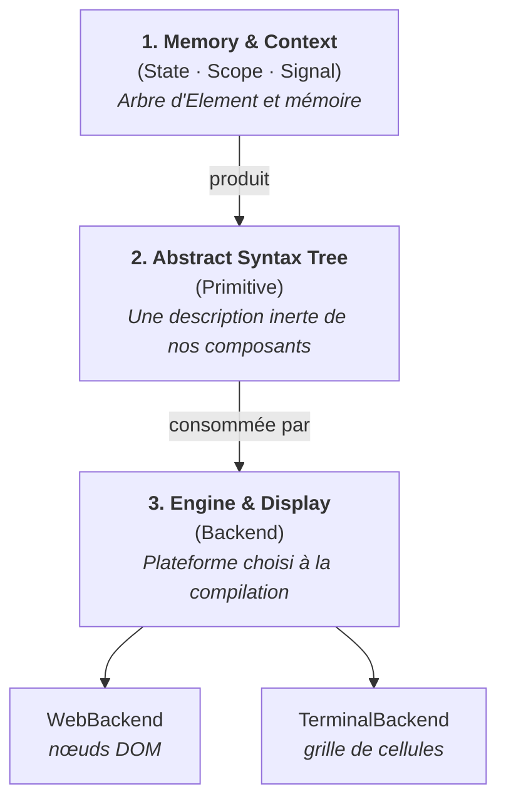

En tant que bon développeut ayant appris le web sur son aspect frontend, nous avons généreusement utilisé des librairies telles que React, Vue, Angular ou encore le petit dernier Svelte.

Prenons un exemple bateau, le fameux `counter` utilisé en démonstration dans une nouvelle application React ou Flutter.

```tsx [counter.tsx]
function Counter() {
  const [counter, setCounter] = useState(0)

  return (
    <div>
      <p>Current value : {counter}</p>

      <div className="flex items-center gap-5 py-5">
        <button onClick={() => setCounter(counter++)}></button>
        <button onClick={() => setCounter(counter--)}></button>
      </div>
    </div>
  )
}
```

## La boîte noire

Nous avons pris l'habitude qu'en écrivant un simple `count++`, l'écran change instantanément, cependant entre les deux, il se passe quelque chose que la plupart d'entre nous décrivons avec des mots empruntés à la documentation, sans avoir jamais regardé le mécanisme.

Cette série consiste à décomposer, démystifier puis construire notre propre moteur UI réactif, en Rust, en partant d'une page blanche.
Une librairie qui ne sera pas un simple jouet qui se contentera d'afficher « Hello world » mais plutôt un véritable moteur robuste et agnostique, avec de l'état persistant, des dépendances suivies automatiquement, des mises à jour ciblées et de la composition de composants.

Afin de diriger cette série d'article, nous imposerons une contrainte extrêmement importante

> Un même composant doit pouvoir être rendu autant dans un navigateur que dans un terminal ou le moteur graphique de Flutter, le tout sans aucune modification du code.

Cette contrainte n'est pas là uniquement pour la démonstration mais pour plusieurs raisons telles que le fait de rendre les erreurs de conception visibles immédiatement et non dépendente de la plateforme sur laquelle l'engine sera utilisé. 

Un moteur qui ne vise que le navigateur peut tricher en permanenc, il lui suffit qu'un composant manipule discrètement un nœud, qu'un style suppose des pixels, qu'une abstraction fuie un peu, et rien ne casse jamais. Le support du terminal ne pardonne aucune de ces fuites, parce qu'il n'a ni nœuds, ni pixels, ni cascade.

La seconde cible est la ca  pacité de test de l'architecture.

Ce premier article pose les bases du projet en répondant à trois questions dont dépendra tout le reste :
1. Que fait réellement un composant quand il « rend » ?
2. Où vit l'état, puisque la fonction se termine ?
3. Et comment le framework décide-t-il quoi redessiner ?

**Prérequis** : suivre cette série d'article suppose de savoir lire du JSX et du Dart pour les comparaisons décrites dans celui-ci. Pour la suite il sera indispensable de connaitre les fondamentaux du langage Rust.

---

## Que gère une librairie frontend

Dans cette article nous opposerons les philosophies suivies par React et Flutter tout en instaurant le fonctionnement des signaux adoptés par VueJS ainsi que SolidJS.

React et Flutter viennent de mondes différents. Sur les trois points qui nous intéressent, ils suivent exactement les mêmes grands principes.

### Un composant ne dessine rien, il décrit

C'est l'idée fondatrice, et elle se trouve-être contre-intuitive lorsque nous avons appris à manipuler directe le DOM du navigateur.

```jsx
function Badge({ label }) {
  return <span className="badge">{label}</span>;
}
```

Dans cet exemple, cette balise `<span>` n'est pas un élément HTML malgré sa ressemblance et son nom.
La syntaxe JSX est transformée en un appel de fonction qui retourne un objet JavaScript ordinaire, dont la forme est à peu près celle-ci

```js
{
  type: "span",
  props: { className: "badge", children: "nouveau" }
}
```

En l'état, aucun nœud n'a été créé dans le DOM, rien n'a modifié la page que vous surveillez attentivement sur votre deuxième écran. Le composant `Badge` a produit une **description** de ce qu'il souhaite. Cette description est une donnée inerte.

Le framework Flutter décrit la même chose mais avec un vocabulaire plus explicite.

Nous créons une classe avec un enseble de propriétés attendues lors de l'instanciation puis la méthode `build` renvoie une structure de donnée décrite, il ne rend rien de lui-même.

```dart
class Badge extends StatelessWidget {
  const Badge({super.key, required this.label});

  final String label;

  @override
  Widget build(BuildContext context) {
    return Container(
      padding: const EdgeInsets.symmetric(horizontal: 8),
      color: Colors.blue,
      child: Text(label),
    );
  }
}
```

Ce `Container` n'est pas une zone dessinée à l'écran. C'est un objet de configuration immuable, d'où le `const` : [la documentation d'architecture de Flutter](https://docs.flutter.dev/resources/architectural-overview) insiste sur le fait que les widgets sont des **descriptions** bon marché, créées et jetées en permanence.

La conséquence est simple et impactante **entre le composant décrit et sa représentation sur l'écran, il existe déjà une couche de données inertes.** Elle est présente dans tous les librairies et frameworks que nous utilisons au quotidien pour concevoir nos fameuses applications dites "réactives".

Nous pouvons considérer cette couche intermédiaire entre la description et l'affichage comme étant une frontière.

### Où vit l'état si la description est jetée

Maintenant que nous avons abordé le rôle des components que nous écrivons par le biais de JSX ou de classes Dart, une deuxième question se pose rapidement

> Si un composant est une description, où vivent les états de nos composants au sein de notre application ?

Reprenons notre premier exemple

```tsx [counter.tsx]
function Counter() {
  const [counter, setCounter] = useState(0)

  return (
    <div>
      <p>Current value : {counter}</p>

      <div className="flex items-center gap-5 py-5">
        <button onClick={() => setCounter(counter++)}></button>
        <button onClick={() => setCounter(counter--)}></button>
      </div>
    </div>
  )
}
```

Lorsque cette fonction se termine et renvoie le descriptif JSX, les variables locales (ici notre `useState`) meurent avec elle. Elle sera rappelée entièrement au prochain rendu. Ainsi une question simple se pose 

> Comment `count` peut-il valloir `1` au second appel, alors que sa déclaration dit littéralement `useState(0)` ?

La réponse est simple mais plus profonde à comprendre : contrairement à ce que l'on pourrait penser, le state de notre variable `count` n'a jamais été stocké dans la fonction.

Il est en réalité stocké dans une structure interne, parallèle à celle que nous écrivons et qui a pour rôle d'associer **une position dans l'arbre** à de la mémoire. La documentation de React le formule autrement en expliquant que [l'état est préservé tant que le composant reste à la même position](https://react.dev/learn/preserving-and-resetting-state), mais cela revient à dire la même chose observée sous un angle différent.

C'est également ce fonctionnement qui explique la règle des hooks instaurées par React, qui cessent d'être arbitraires une fois que nous prenons conscience de son fonctionnement une fois sous le capot.

```jsx
function Panel({ isOpen }) {
  const [count, setCount] = useState(0);

  if (isOpen) {
    // Interdit par React : un hook ne se déclare jamais dans une condition.
    // Son rang change avec isOpen, donc la cellule retrouvée au rendu
    // suivant n'est plus la bonne.
    const [draft, setDraft] = useState("");
  }
}
```

Ce code est complètement invalide, et non discutable. Les [règles des hooks](https://react.dev/reference/rules/rules-of-hooks) interdisent explicitement d'appeler un hook dans une condition, une boucle ou une fonction imbriquée. La raison est exactement celle que nous venons de voir : l'identité d'une cellule d'état est **son rang d'appel**, pas son nom. 

Un hook conditionnel décale tous les suivants, et React n'a aucun moyen de s'en apercevoir autrement qu'en constatant, au rendu suivant, que le nombre de hooks a changé.

Flutter rend cette séparation visible dans le typage ainsi que dans sa construction, ce qui en fait le meilleur support pédagogique des deux

```dart [Counter.dart]
class Counter extends StatefulWidget {
  const Counter({super.key});

  @override
  State<Counter> createState() => _CounterState();
}

class _CounterState extends State<Counter> {
  int count = 0;

  @override
  Widget build(BuildContext context) {
    return TextButton(
      onPressed: () => setState(() => count++),
      child: Text('$count'),
    );
  }
}
```

Cette séparation en deux classes pour un composant est plus lourd à écrire mais également plus explicite et n'a rien d'arbitraire. Le composant `Counter` est la description, immuable, recréée à chaque rendu du parent. `_CounterState` est une mémoire, et elle survit au travers des multiples re-render. Entre les deux, Flutter maintient un arbre d'[`Element`](https://api.flutter.dev/flutter/widgets/Element-class.html), persistant, qui représente l'instanciation d'un widget à un endroit donné et qui tient l'objet `State`.

Nous pouvons ainsi en déterminer une formule simple
> Un framework est une machine à faire correspondre des descriptions éphémères à de la mémoire persistante, l'ensemble identifiée par position.

### Le traducteur vers le monde réel est déjà interchangeable

Jusqu'à présent, l'ensemble de notre introspection du monde merveilleux de la réactivité des librairies frontend nous enseigne une méthodologie de travail mais il manque une pièce importante, le **renderer**.

Une fois que nous savons **quoi** afficher et **où** vit l'état, il faut dessiner concrètement notre interface.

```jsx [main.tsx]
import { createRoot } from 'react-dom/client'
import App from ''./App'

const app = document.getElementById('root')
createRoot(app).render(<App />)
```

Le point remarquable de ces quatre lignes n'est pas ce qu'elles contiennent mais plutôt ce qu'elles ne contiennent pas. 

Le composant `App` représentant le point d'entré de notre application ainsi que tous ses descendants ignorent l'existence du DOM de votre navigateur. Le seul fichier qui nomme explicitement `document`, c'est le point d'entrée. Remplacez `react-dom` par un autre renderer et les composants ne bougent pas : c'est ce qui rend React Native possible.

A l'inverse, Flutter descend d'un cran plus bas grâce à un troisième arbre, celui des `RenderObject`, qui prend en charge le layout et la peinture, en dessous des widgets et des éléments.

Cette pièce est donc déjà remplaçable dans les frameworks existants mais se trouve-être simplement très rarement remplacée.

---

## Trois phases, trois couches

Ce que nous venons d'observer donne directement l'architecture du framework, avec une règle unique : **aucune couche ne connaît le type d'une couche située en dessous d'elle**.



### Conception et structuration
Attribue à chaque instance de composant un identifiant stable, le `ComponentId`, et lui associe des cellules de mémoire qui survivent aux rendus.

Un composant y accède via un objet de contexte, le `Scope`, qui lui est passé pendant son exécution. Ce `Scope` ne contient rien de la plateforme : ni handle DOM, ni descripteur de terminal, ni contexte de dessin. Un composant qui le reçoit ne peut structurellement pas savoir où il tourne.

### Descriptions
Cette couche représente notre équivalent du JSX compilé ou du widget Flutter sous la forme d'un arbre de descripteurs que nous appelerons des `Primitive`, composé de conteneurs, de texte, de styles et de gestionnaires d'événements. De la donnée pure.

Une nuance importante par rapport aux deux frameworks étudiés, cet arbre contient un type de nœud supplémentaire, l'**ancrage**. Quand un composant en contient un autre, l'arbre du parent ne contient pas le rendu de l'enfant, il contient un trou portant le `ComponentId` de cet enfant. Nous verrons par la suite ce détail permettant la mise à jour ciblée possible.

Le vocabulaire de style de cette couche ne peut contenir que ce que les N plateformes supportées sont capables d'honorer : un axe, un espacement, une couleur, une graisse. Un espacement y est un cran sur une échelle abstraite, pas une distance en pixels, et c'est le backend qui décidera de le traduire en `rem` ou en nombre de colonnes.

### Plateforme cible
Cette dernière couche est le seul endroit du framework autorisé à être dépendant du type de plateforme sur laquelle fonctionnera notre application. Dans le cadre de React, c'est lui qui déclare explicitement l'usage de `react-dom` pour un usage de la librairie au sein d'un navigateur, il est réduit à quatre opérations :
1. Construire l'arbre initial
2. Remplacer le contenu situé sous un ancrage (`#root`)
3. Retirer un ancrage et ce qui pend en dessous
4. Récupérer les événements survenus depuis le dernier tour.

Un backend web les implémente en manipulant des nœuds réels, un backend terminal en marquant des régions comme sales et en redessinant au flush suivant, puisqu'il n'a aucune notion de nœud persistant.

---

## Painting, doit-on comparer ou connaitre

Reste la question centrale. L'état a changé, que faut-il refaire ?

### Comparer et appliquer
A ce jour, la réponse apportée par React est celle de **recalculer**, puis **comparer** les différences.

React réexécute la fonction du composant, obtient un nouvel arbre de descripteurs, le compare au précédent et n'applique au DOM que les opérations nécessaires. La documentation décrit ce cycle sous le nom de [render and commit](https://react.dev/learn/render-and-commit), et deux de ses propriétés nous intéressent

1. Le rendu est récursif : un composant qui se réexécute entraîne ses descendants, sauf dans le cas d'une [mémorisation explicite](https://react.dev/reference/react/memo)
2. Le DOM n'est touché que là où il existe une différence entre deux rendus.

Le modèle mental est d'une simplicité redoutable et c'est ce qui en fait sa principale force
> L'interface est une fonction de l'état, le framework se débrouille avec le reste.

### Savoir à l'avance

Une autre philosophie consiste à observer **quelles valeurs réactives** sont lues durant la phase d'exécution du composant.

Ce que le moteur en retient n'est plus un arbre plus ou moins volumineux dont il est nécéssaire de comparer plus tard mais uniquement une simple liste d'abonnements. 

La chaine pour une valeur est simple
- Le counter a une valeur N qui est lue par des composants X ou Y
- Loesqu'elle change, il n'y a rien à calculer, il suffit de consulter la liste.

Le contraste est visible dans le code. Voici le compteur React vu plus haut, puis son équivalent en signaux :

```jsx
// Modèle Virtual DOM : ce corps s'exécute à chaque changement
function Counter() {
  const [count, setCount] = useState(0);
  console.log("exécuté à chaque rendu");

  return <button onClick={() => setCount(count + 1)}>{count}</button>;
}
```

```jsx
// Modèle par signaux : ce corps s'exécute une seule fois
function Counter() {
  const [count, setCount] = createSignal(0);
  console.log("exécuté une seule fois");

  return <button onClick={() => setCount(count() + 1)}>{count()}</button>;
}
```

La différence tient dans les parenthèses. `count()` est un appel de fonction, donc une lecture observable, et [c'est ce que SolidJS met en avant](https://docs.solidjs.com/concepts/intro-to-reactivity)
> Le corps du composant ne s'exécute qu'une fois, et seul le fragment qui a lu la valeur se rejoue.

Pour la suite de notre série d'articles nous opterons pour le modèle des signaux pour deux raisons :

::::step-group
  :::step{title="Un diff parle le langage de sa cible"}
    Les instructions « Insère ce nœud avant celui-là », « modifie cet attribut », « déplace cet enfant » relèvent d'un vocabulaire propre au DOM. Un terminal ne dispose d'aucune de ces opérations, il a une grille que nous réécrivons. Un moteur de diff qui serait pertinent pour les deux serait en réalité deux moteurs qui se ressemblent de loin.
  :::

  :::step{title="La granularité est le seul levier dans un terminal"}
    Un navigateur amortit énormément, et reconstruire quelques dizaines de nœuds y passe inaperçu. Un terminal écrit des séquences d'échappement dans un flux, redessiner un large ensemble se voit à l'oeil nu par des clignotements, une approche de remplacement localisé est davantage pertinent.
  :::
::::


Il y a une troisième raison qui se trouve-être plus personnelle, pour une série dont le but est de comprendre, le modèle par signaux est le plus lisible. Il n'y a pas d'algorithme de diff dans lequel cacher la logique, chaque lien de dépendance apparaît explicitement dans le code du moteur.

:::callout{variant="info"}
Ce n'est aucunement un jugement de valeur de ma part. Le Virtual DOM conserve un avantage que nous allons perdre : avec lui, le développeur n'a aucune règle à respecter sur l'endroit où il lit son état. Le modèle par signaux, lui, en impose une, et nous verrons laquelle.
:::

---

## Les signaux, l'art de re-rendre un contenu ciblé

Reprenons l'ancrage. Considérons une page contenant une barre latérale statique et un compteur :

```
Page                        ← ne lit aucune valeur réactive
├── Sidebar                 ← ne lit aucune valeur réactive
└── Anchor(Counter#7)       ← trou nommé dans l'arbre de Page
    │
    └── Counter#7       ← lit le signal `count`
```

Quand `count` change, le moteur consulte la liste de ses abonnés et n'y trouve qu'un identifiant, `Counter#7`. Il réexécute donc uniquement ce composant, obtient un nouvel arbre de descripteurs, et demande au backend de remplacer ce qui se trouve sous l'ancrage `Counter#7`.

Le composant `Page` ne se réexécute pas, `Sidebar` non plus et le backend n'a rien à chercher parce que l'ancrage lui a donné l'adresse au moment du montage.

C'est là que les trois couches se rejoignent. L'identité provient de la couche 1, le trou vient de la couche 2, et la couche 3 n'a qu'à savoir remplir un trou dont nous lui donnons le nom.

Cette mécanique a une conséquence que je trouve élégante, et qui simplifie drastiquement l'API du framework. Certains frameworks distinguent explicitement les composants qui se mettent à jour de ceux qui sont rendus une seule fois, nous pouvons d'ailleurs citer [GPUI](https://gpui.rs) qui introduit une mécanique `Render` (composant a état) et `RenderOnce` (composant relevant uniquement de l'UI).

Dans notre cas, la distinction devient inutile : **un composant qui n'a lu aucune valeur réactive n'apparaît dans la liste d'abonnés d'aucun signal, donc il ne pourra jamais être marqué comme devant se réexécuter**. 

Il est « rendu une seule fois » par conséquence mécanique, pas par déclaration. Un seul trait `Render` suffira, et le moteur déduira le reste de ce qu'il aura observé.

---

## Ce que Rust va changer

Une dernière remarque avant de refermer cet article, parce qu'elle explique une bonne partie du suivant.

Tout ce que nous venons de décrire suppose un graphe : des valeurs qui connaissent leurs lecteurs, des lecteurs qui référencent leurs valeurs.

En JavaScript, cette typilogie de structure s'écrit naturellement sans y penser, le garbage collector s'occupe du reste, cependant en Rust nos observations relèvent du partage mutable avec des cycles, et le borrow checker le refuse à juste titre puisque rien ne garantit qu'un lecteur soit encore vivant au moment où nous voulons le réveiller.

Deux approches existent :
1. Stocker toutes les valeurs réactives dans une arène centrale et ne manipuler que des indices typés, ce qui rend les handles très légers à copier mais oblige à nettoyer la mémoire à la main.
2. Passer par du comptage de références, ce qui laisse le langage gérer les durées de vie, au prix de clonages explicites et de vérifications d'emprunt déplacées à l'exécution.

Cette série prend la seconde option, pour une raison autant pédagogique que technique : la libération automatique évite de traiter la comptabilité mémoire en même temps que le mécanisme réactif, et je préfère traiter un sujet à la fois. Le choix a des conséquences, notamment le fait que rien de tout cela ne sera thread-safe en l'état.

Du côté de l'écriture des composants, l'objectif est d'obtenir une API fluente et typée, sans macro et sans pseudo-JSX : des méthodes de style courtes et chaînées, dans l'esprit de ce que [GPUI](https://github.com/zed-industries/zed/tree/main/crates/gpui), le framework que Zed a écrit pour son propre éditeur, combine avec des noms empruntés à Tailwind.

L'intérêt par rapport à une macro est qu'une fonction permet l'autocomplétion, les erreurs pointent la bonne ligne, et une combinaison invalide est refusée à la compilation plutôt que découverte à l'expansion.

Et comme pour l'exemple `createRoot` du début, **le point d'entrée sera le seul fichier à savoir sur quelle plateforme il tourne**, le backend y sera injecté par une feature Cargo. Aucun composant ne sera au courant.

---

## La suite

Le second article attaquera la couche 1 en Rust : le runtime, le graphe d'abonnements, le suivi automatique des lectures, et la boucle qui vide la file des composants à réexécuter. C'est le cœur du réacteur, et c'est là que les contraintes du langage deviennent concrètes.

::::card-group{cols=2}
  :::card{label="Architecture de Flutter" icon="lucide:layers"}
    La meilleure description publique de la séparation entre description, élément et rendu.

    [Lire la documentation](https://docs.flutter.dev/resources/architectural-overview)
  :::

  :::card{label="Réactivité dans SolidJS" icon="lucide:zap"}
    Le modèle par signaux expliqué par ses auteurs, dont nous allons reprendre le principe.

    [Lire la documentation](https://docs.solidjs.com/concepts/intro-to-reactivity)
  :::
::::
