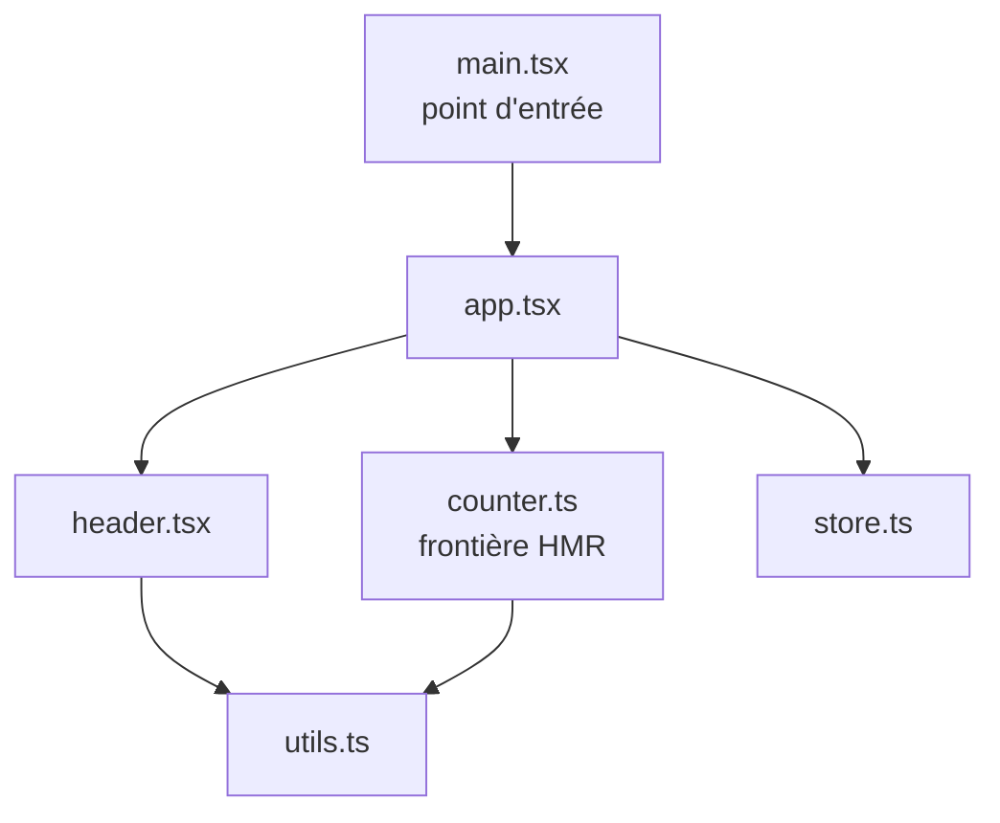
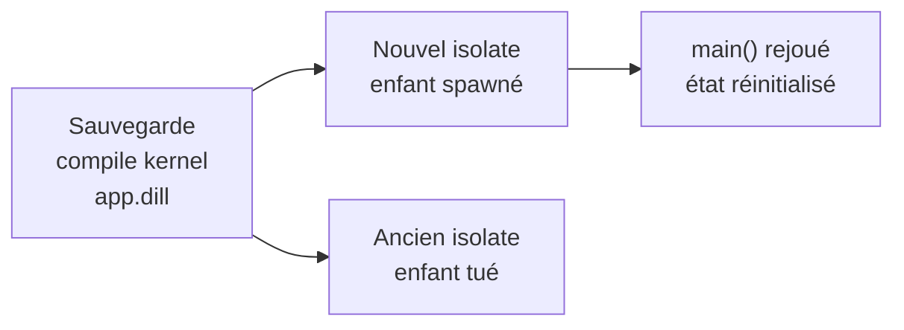
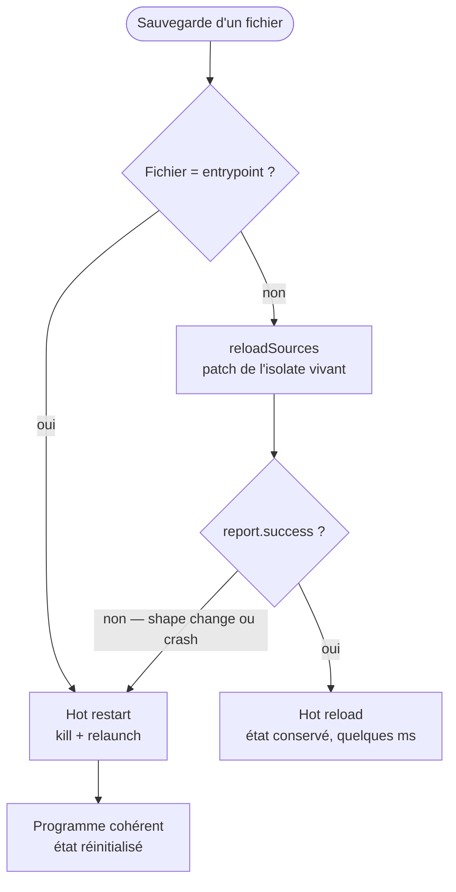

## Qu'est-ce qu'un HMR

> **HMR** signifie *Hot Module Replacement*. Il consiste à remplacer des unités de code dans un programme **déjà en cours d'exécution**, sans le redémarrer, et idéalement sans perdre son état en mémoire.

L'idée est née dans le monde du web, d'abord pensée pour le frontend. Mais le besoin, lui, est universel : raccourcir au maximum la boucle entre « je modifie une ligne » et « je vois le résultat ».

Pour bien situer le terme, il faut distinguer trois gestes qu'on confond souvent :

- **Cold reload** : on arrête tout et on relance le programme à la main. Aucune assistance, le degré zéro.
- **Hot restart** : un superviseur relance automatiquement l'application avec le code à jour à chaque sauvegarde. La boucle de feedback est instantanée, mais **l'état repart de zéro** : `main()` est rejoué depuis le début.
- **Hot reload** : le code modifié est injecté dans le programme en cours d'exécution. Les variables globales, les connexions ouvertes, tout est conservé. **Seul le code change.**

Les trois sont indispensables, et un bon outillage propose souvent les deux derniers côte à côte. Tout l'enjeu d'un HMR est de pousser le curseur aussi loin que possible vers le hot reload, tout en gardant un filet de sécurité quand il n'est pas applicable.

---

## Une DX popularisée par Vite et Flutter

Si l'action desauvegarder et voir instantanément, sans perdre les états actuels de l'application est devenu une attente par défaut, c'est largement grâce à deux outils venus d'écosystèmes opposés.

Côté web, **ViteJS** a rendu le rechargement de modules quasiment instantané, quelle que soit la taille, le poids ou la complexité du projet. On voit ses modifications de code (React, Vue…) se refléter en temps réel, sans jamais recharger la page.

Du côté de l'écosystème Dart, la core team de **Flutter** a bâti un outillage équivalent, taillé pour son propre framework.

Le hot reload y est devenu un réflexe.

Nous modifions un widget, l'écran se met à jour aussitôt, et surtout **l'état de l'application est préservé**.

Le postulat est simple, nous restons sur le même écran, avec les mêmes données en mémoire, le même scroll et les mêmes champs remplis. Nous n'avons plus besoin de refaire tout le parcours pour revenir là où on en était.

Ces deux mondes opposés en apparence suivent en réalité la même promesse et attente chez les développeurs : un développement plus rapide et gagner en productivité.

Cette exigence a fini par déborder de son scope initial. Dès que l'on conçoit une application en **Dart pur**, un serveur HTTP, un worker, un outil en ligne de commande… n'importe quel projet hors de Flutter, cette commodité n'existait pas. Nous en revenons à une procédure classique, celle du cold reload : arrêter, relancer, attendre, recommencer. 

> Universaliser les processus itératifs de développement à l'ensemble des applications Dart, et non plus seulement à celles construites avec Flutter. 

C'est précisément ce manque qui m'a motivé dans la création de ce projet qu'est [HMR](https://pub.dev/packages/hmr).

---

## Le fonctionnement de ViteJS

Comprendre le fonctionnement de ViteJS permet de mettre en lumière toute la suite, je me suis clairement basé sur son fonctionnement afin de conçevoir le projet.

Durant la phase de développement, contrairement à des alternatives historiques, ViteJS ne *bundle* pas l'application. 

L'approche classique (webpack et similaire) commence par **assembler tous les fichiers en un seul gros paquet** avant de pouvoir servir quoi que ce soit ; plus le projet grossit, plus cette étape s'allonge. 
En opposition à ces solutions historiques, ViteJS ne pré-assemble rien, il se contente de consommer chaque fichier source tel quel, en tant que simple **module ES natif (ESM)** puis laisse le navigateur les réclamer **à la demande**, au fil des `import` qu'il rencontre.

Pour orchestrer toute cette machinerie, ViteJS tient à jour un **graphe de modules** représentant une carte mentale de « qui importe qui ». Le plus simple est de se le représenter comme un arbre de dépendances, enraciné au point d'entrée et ramifié vers chaque fichier importé.



Chaque noeud est considéré comme étant un module, chaque flèche représente un `import`. C'est précisément cette carte mentale qui rend la mise à jour ciblée possible en partant du fichier qui vient de changer puis en remontant et répercutant les changements sur les autres modules dont il dépend, ViteJS sait immédiatement qui en dépend à un instant T et ainsi des segments à ré-évaluer, le tout sans toucher au reste de l'arbre.

Lorsqu'un fichier change, ViteJS ne reconstruit pas le bundle. Il consulte le graphe, calcule la **chaîne minimale** entre le fichier modifié et la *frontière HMR* la plus proche puis pousse une mise à jour ciblée au navigateur **via une connexion WebSocket**.

Une frontière HMR, c'est un module qui « s'accepte » lui-même :

```ts [cart.ts]
interface CartState {
  items: string[]
  total: number
}

// État local du module : restauré depuis la version précédente s'il existe,
// sinon initialisé à vide.
const cart: CartState = import.meta.hot?.data.cart ?? { items: [], total: 0 }

const totalLabel = document.querySelector<HTMLSpanElement>('#total')!

export function addItem(name: string, price: number): void {
  cart.items.push(name)
  cart.total += price
  totalLabel.textContent = `${cart.total} €`
}

if (import.meta.hot) {
  // Le module s'accepte lui-même : Vite remplace son code à chaud,
  // sans recharger la page entière.
  import.meta.hot.accept()

  // Avant d'être remplacé, il transmet son état à la nouvelle version,
  // qui le relit en haut du fichier. Si le panier contenait 3 articles,
  // il les contient toujours après la sauvegarde — pas de panier vidé.
  import.meta.hot.dispose((data) => {
    data.cart = cart
  })
}
```

Ainsi seul le module concerné (et modules dont il dépend) est ré-exécuté, le reste de l'application continue de tourner, et **l'état est préservé**. Comme il n'y a aucune phase de rebundle, la vitesse de mise à jour reste constante, que le projet fasse dix ou dix mille fichiers.

Retenons deux ingrédients, car ce sont exactement ceux qu'il faudra retrouver en Dart : 
1. un moyen de remplacer chirurgicalement une unité de code dans un système vivant
2. un canal pour pousser cette mise à jour au programme en cours d'exécution

---

## Isolates et hot restarting

Mon objectif initial était clair : retrouver cette boucle de mise à jour instantané pour n'importe quelle application Dart.

Le bon point de départ, en Dart pur, ce sont les [`isolates`](https://dart.dev/language/isolates). Un isolate est une unité d'exécution autonome ayant sa propre mémoire dont nous pouvons exécuter depuis un fichier compilé et communiquer avec lui par messages. L'isolate est la primitive la plus directe pour faire tourner l'application tout en gardant la main dessus.

Ainsi en découle la première architecture, simple et robuste : un **isolate superviseur** surveille les fichiers, l'application tourne dans un **isolate enfant**. 

À chaque sauvegarde, le superviseur recompile l'entrypoint en une snapshot kernel, remplace l'enfant puis le relance directement.
Il est important de noter que ce processus de re-compilation assure que le code exécuté est conforme et fonctionnel mais implique également un micro-délai avant que le nouvel isolate ne soit prêt à recevoir des messages.

```dart [main.dart]
// Le runner détient l'isolate enfant courant et son canal de messages.

Future<void> main() async {
  Isolate? _isolate;
  ReceivePort? _receivePort;
  SendPort? _sendPort;
  
  // 1. Compiler l'entrypoint en snapshot kernel (.dill)
  final result = await Process.run(
    'dart',
    ['compile', 'kernel', entrypoint.path, '-o', dillFile.path],
  );
  
  if (result.exitCode != 0) {
    // surfacer proprement l'erreur de compilation, puis attendre la prochaine save
    return;
  }

  // 2. Tuer l'isolate enfant déjà détenu par le runner.
  //    Au tout premier lancement, _isolate est null : ce kill est ignoré.
  _isolate?.kill(priority: Isolate.immediate);

  // 3. Le remplacer par une version à jour, puis rétablir le canal de
  //    messages : l'enfant renvoie son SendPort comme premier message.
  _receivePort = ReceivePort();
  _isolate = await Isolate.spawnUri(dillFile.uri, args, _receivePort!.sendPort);
  _sendPort = await _receivePort!.asBroadcastStream().first;
}
```



Soyons précis sur ce que cette implémentation accomplissait, parce qu'elle est à la fois puissante mais imparfaite. Elle livrait un vrai **hot restarting**, automatique et fiable, sans la moindre relance manuelle. Les erreurs de compilation étaient capturées et affichées proprement au lieu de faire planter la session, et un canal `SendPort` / `ReceivePort` permettait même au superviseur et à l'application d'échanger des messages.

Autrement dit, elle tenait déjà **la moitié la plus importante de la DX** : la boucle de redémarrage immédiat.

Cette approche était le bon premier design exploité avec les primitives disponibles. Flutter lui-même propose le hot restart en geste de premier ordre, sur la touche `R`. Sa seule limite mais assumée, découlait directement du même mécanisme : puisque l'isolate enfant est remplacé à chaque fois, `main()` est rejoué et l'état en mémoire repart de zéro. 

Le cache, la session, le compteur, la connexion ouverte : tout est reconstruit à chaque sauvegarde.

C'était le point de départ qu'il fallait : une base solide sur laquelle greffer la pièce manquante, la **préservation de l'état**.

L'expérience était déjà fonctionnel grâce à un fonctionnement zéro-configuration.

```sh [Terminal]
dart pub global activate hmr
hmr
```

`hmr` surveillait les fichiers `.dart`, lançait l'entrypoint et le relançait à chaque sauvegarde. Un bloc `hmr:` optionnel dans le `pubspec.yaml` permettait d'ajuster le comportement :

```yaml [pubspec.yaml]
hmr:
  entrypoint: bin/server.dart
  debounce: 50
  includes:
    - "**/*.dart"
  excludes:
    - "test/**"
```

Et pour les applications qui voulaient dialoguer avec le superviseur, le canal de messages était exposé directement :

```dart [main.dart]
import 'package:hmr/hmr.dart';

void main() {  
  final runner = Runner(
    tempDirectory: Directory.systemTemp,
    entrypoint: File(
      path.join([
        Directory.current.path,
        'bin',
        'main.dart'
      ])
    ));

  final watcher = Watcher(
    onStart: () => print('Watching for changes...'),
    middlewares: [
      IgnoreMiddleware(['~', '.dart_tool', '.git', '.idea', '.vscode']),
      DebounceMiddleware(Duration(milliseconds: 5), dateTime),
      IncludeMiddleware([Glob("**.dart")]),
    ],
    onFileChange: (int eventType, File file) async {
      final action = switch (eventType) {
        FileSystemEvent.create => 'created',
        FileSystemEvent.modify => 'modified',
        FileSystemEvent.delete => 'deleted',
        FileSystemEvent.move => 'moved',
        _ => 'changed'
      };
      
      print('File $action ${file.path}');
      await runner.reload();
    });

  watcher.watch();
  runner.run();
}
```

Pour les 20/80 des cas d'usage, ce procédé suffisait et permettait à un serveur que l'on souhaite juste voir redémarrer proprement à chaque sauvegarde, la promesse est respectée.

---

## Dart et vm_service

Il est maintenant temps pour le projet de franchir la dernière marche de cette aventure, celle de l'état préservé au travers des redémarrage.

Basiquement nous devions considérer les states persistants dans notre main, au sein de l'isolate parent, qui lui, ne meurt que lorsque le programme se termine. 

Pour s'affrenchir de cette obligation, il nous fallait changer notre approche, et elle était sous mes yeux depuis le début : la **Dart VM** elle-même, pilotée via le package [`vm_service`](https://pub.dev/packages/vm_service).

Toute application Dart peut être lancée avec un serveur de service activé (`--enable-vm-service`). Ce service expose, par un protocole RPC, des opérations sur la VM en cours d'exécution et notamment **`reloadSources`**. Cette opération demande à la VM de **patcher le code d'un isolate vivant** : elle recompile uniquement ce qui a changé, remplace les corps de fonctions et les définitions de classes dans l'isolate en cours, et le laisse continuer à tourner. L'isolate ne meurt pas. Son état est intact.

Ce n'est pas un détour exotique : **c'est précisément la primitive sur laquelle repose le hot reload de Flutter.** Lorsque l'on appuie sur `r` dans le terminal après avoir exécuté `flutter run`, l'outil envoie un `reloadSources` au VM service de l'application. Le mécanisme de bas niveau est identique pour un serveur Dart et Flutter.

La nouvelle architecture propose donc de lancer l'application en tant que **véritable processus enfant** (et non plus un isolate interne) avec le VM service activé, s'y connecter, puis à chaque sauvegarde d'émettre un `reloadSources` sur l'isolate vivant, nous arrivons ainsi à un résultat cohérent avec notre souhait initial.

```dart [vm_service_process_strategy.dart]
Future<ReloadOutcome> _doReload(String trigger, FsEvent? fileEvent) async {
  // Patcher le code dans l'isolate VIVANT, via le VM service
  final report = await service.reloadSources(isolateId, force: true);

  if (report.success ?? false) {
    // État en mémoire conservé, code à jour. Quelques millisecondes.
    return ReloadOutcome.ok;
  }

  // La VM ne peut pas réconcilier ce changement → repli sur un restart complet
  await _killProcess();
  await _launch();
  
  return ReloadOutcome.fallbackUsed;
}
```

Mais préserver l'état n'est pas toujours possible ni même souhaitable. Deux situations imposent de revenir, volontairement, au hot restart hérité de la première implémentation :

- **Modification de l'entrypoint** : Un hot reload recharge le *code* de `main()`, mais ne le **rejoue jamais**. Si votre initialisation change alors une route ajoutée au démarrage, une dépendance importéer dans `main()` ou encore la modification d'un contenu resterait invisible. Nous forçons donc un restart dès que le fichier modifié *est* l'entrypoint.
- **Erreur fatale ou changement de forme** : Si l'application a planté ou si la modification change la *forme* du programme d'une manière que la VM n'est pas en capacité de réconcilier (ajout d'un champ d'instance, modification d'une hiérarchie de classes…), `reloadSources` échoue. Plutôt que de rester dans un état incohérent, nous basculons sur un restart complet de l'application.

---

## Le modèle hybride

La version actuelle ne remplace donc pas le hot restart par le hot reload : elle **combine les deux approches** sous un modèle hybride. 

Le hot reload devient le chemin par défaut; le hot restart de la première implémentation devient le filet de sécurité, déclenché automatiquement quand le rechargement à chaud ne s'applique pas. C'est le compromis exact proposé par Flutter : hot reload dès que possible c'est possible, puis hot restart s'il le faut, sans que l'utilisateur ait à choisir.

::::step-group
  :::step{title="Un fichier change"}
    Le watcher émet un événement filtré (globs d'inclusion/exclusion, debounce).
    ```dart [main.dart]
    final orchestrator = ReloadOrchestrator(
      strategy: strategy,
      watcher: FileWatcher(Directory.current), // 👈 Watch for file changes
      debounce: const Duration(milliseconds: 50),
      filters: [
        ignoreSegment(const ['.git', '.dart_tool']),
        includeGlobs([Glob(path.join(root, '**.dart'))]),
      ],
    );
    ```
  :::
  :::step{title="Est-ce l'entrypoint ?"}
    Si oui, restart complet immédiat — `main()` doit être rejoué. On ne tente pas le hot reload.
  :::
  :::step{title="Sinon, tenter un hot reload"}
    `reloadSources` patche l'isolate vivant. En cas de succès : terminé, l'état est conservé, en quelques millisecondes.
  :::
  :::step{title="La VM refuse, ou l'app a planté ?"}
    Repli automatique sur un restart complet. Le programme reste toujours cohérent, l'utilisateur n'a rien à faire.
  :::
::::

Quel que soit le cas rencontré, nous retombons systématiquement sur un état cohérent de notre application : l'état est ainsi préservé lorsque le hot reload réussit, et reconstruit proprement quand il faut redémarrer.



Mises côte à côte, les deux versions se répondent point par point :

| | Première implémentation | Nouvelle version (hybride) |
|---|---|---|
| Modèle d'exécution | isolate enfant dans le superviseur | process enfant indépendant (`--enable-vm-service`) |
| Geste par défaut sur save | restart de l'isolate | hot reload sur l'isolate vivant |
| État en mémoire | reconstruit à chaque save | conservé sur un hot reload |
| Recompilation | snapshot kernel, en sous-process | incrémentale, dans la VM |
| Latence ressentie | rapide | quasi instantanée |
| Repli sur restart | c'était le mode unique | automatique sur entrypoint / shape change / crash |

> Le mode unique d'hier est devenu le filet de sécurité d'aujourd'hui. 

Rien n'a été jeté : la première brique a trouvé sa juste place dans un ensemble plus complet.

### Usage zéro config

Pour l'usage zéro-configuration, rien ne change — c'est toujours `hmr` depuis la racine du projet. La nouveauté se voit quand l'application veut **réagir** aux rechargements. 

Le développeur peut alors écouter les événements émis par `hmr` : il importe l'API runtime et s'abonne à des événements typés.

```dart [main.dart]
import 'package:hmr/runtime.dart';

void main(List<String> args) {
  Hmr.instance.init();

  // Le code a été patché à chaud, l'état est intact :
  // l'occasion de ré-enregistrer des handlers, d'invalider un cache…
  Hmr.instance.onReload((_) => print('Hot reload — état préservé'));

  // Restart complet : nous repartons de zéro, puis ré-amorçons le nécéssaire
  Hmr.instance.onRestart((_) => print('Hot restart — ré-amorçage'));

  // Le fichier a été modifié : nous pouvons ré-appliquer les changements
  Hmr.instance.onFileModified((change) => print('Sauvegardé : ${change.path}'));

  // ... votre application démarre ici
}
```

### Le détail qui compte

L'API `runtime` est un **no-op** en dehors du superviseur (détecté via une variable d'environnement). Le même `main()` fonctionne donc à l'identique sous `hmr` et sous un simple `dart run`, sans import conditionnel ni drapeau de build. Cela permet de nous assurer d'un fonctionnement cohérent et identique entre la phase de développement et celle de la production. 

### Composer son propre runner

Quand l'implémentation par défaut ne suffit pas, ou que vous voulez un comportement sur-mesure, la bibliothèque expose toutes ses briques pour **composer votre propre runner** :

```dart [custom_hmr.dart — extrait]
Future<void> main(List<String> args) async {
  final root = Directory.current.path;

  final strategy = VmServiceProcessStrategy(
    entrypoint: File(path.join(root, 'bin', 'main.dart')),
    args: args,
  );

  final orchestrator = ReloadOrchestrator(
    strategy: strategy,
    watcher: FileWatcher(root),
    debounce: const Duration(milliseconds: 50),
    filters: [
      ignoreSegment(const ['.git', '.dart_tool']),
      includeGlobs([Glob(path.join(root, '**.dart'))]),
    ],
  );

  // Bring your own presenter, or use AnsiPresenter / JsonPresenter.
  final presenter = AnsiPresenter()
    ..attach(orchestrator.events);

  ProcessSignal.sigint.watch().listen((_) async {
    await orchestrator.stop();
    await presenter.dispose();

    exit(0);
  });

  await orchestrator.start();
}
```

Chaque composante de cet exemple est une brique indépendante et remplaçable, ce sont exactement celles que le CLI intégré assemble pour vous :

- **`VmServiceProcessStrategy`** lance l'entrypoint comme process enfant et pilote le VM service, le cœur du hot reload. Implémenter `RunStrategy` permet de la remplacer entièrement.
- **`FileWatcher`** surveille l'arborescence et émet un flux d'événements de fichiers.
- **Les filtres** (`ignoreSegment`, `includeGlobs`, `excludeGlobs`) décident quels changements déclenchent réellement un rechargement.
- **Le présentateur** (`AnsiPresenter`, `JsonPresenter`, ou le vôtre) traduit le flux d'événements typés en sortie : terminal lisible, JSON *pipeable*, ou tout autre format.
- **`ReloadOrchestrator`** câble le tout — stratégie, watcher, filtres et debounce — et expose `start` / `stop` / `reload` / `restart`.

Le même socle est utilisé par les trois usages d'un seul tenant : 
- `hmr` en zéro-configuration
- l'API runtime pour réagir aux événements
- le runner sur-mesure quand on veut tout contrôler

Rien n'est caché derrière le binaire : ce que fait `hmr` par défaut, vous pouvez le recomposer pièce par pièce.

---

## Flow et productivité accrue

Au-delà du mécanisme, ce qui compte vraiment est l'implication pour le développeur sur son code, sauvegarde après sauvegarde, toute la journée.

La première implémentation avait déjà réglé le plus visible, la boucle de redémarrage immédiat, sans relance manuelle. Le gain propre à la version hybride se joue ailleurs, sur un poste de coût plus discret mais souvent plus cher, celui de **remonter jusqu'à l'état où l'on travaillait.**

Prenez une application réellement *statefull* : un serveur avec des sessions ouvertes, un worker au milieu d'une file, un CLI interactif à plusieurs étapes. Quand l'état repart de zéro à chaque sauvegarde, nous devons le reconstruire à la main avant même de voir l'effet de notre modification, se reconnecter, re-naviguer jusqu'à la bonne requête, re-remplir le formulaire, réchauffer le cache, rétablir la connexion. Sur ce type d'application, atteindre l'état où le bug se manifeste est souvent **plus long que d'écrire le correctif lui-même.**

C'est exactement ce coût que le hot reload supprime. L'état reste en place; nous itèrons sur le correctif sans repayer la mise en situation à chaque essai. Le bénéfice n'est pas tant « c'est plus rapide » car la première version l'était déjà mais plutôt que « je ne perds plus le fil ».

:::callout{variant="info"}
Le vrai gain n'est plus seulement la seconde gagnée par sauvegarde à chaque itération mais l'enchaînement ininterrompu.
Aucune rupture d'attention, aucune remise en situation mentale, plus de « où en étais-je déjà ? ». Sur une journée de plusieurs centaines de sauvegardes, ces micro-interruptions évitées pèsent bien plus lourd que le temps de compilation.
:::

Pour une équipe, l'effet se cumule sur trois plans :

- **Moins de friction, donc plus d'expérimentation** : lorsque essayer une idée ne coûte presque rien, nous en essaie davantage, ainsi le code n'en sort que meilleur.
- **Le flow préservé** : rester « dans la zone » est ce qui distingue une heure productive d'une heure hachée. Réduire les interruptions, c'est protéger la ressource la plus rare d'un développeur : son attention continue.
- **La DX qu'on attend désormais par défaut** : les développeurs arrivent avec les réflexes de Vite et de Flutter. Offrir la même immédiateté au Dart en ligne de commande réduit la marche à l'entrée et rend l'outil naturel à adopter.

Au bout du compte, tout ce chemin tient en quelques gains très concrets :

::::card-group{cols=2}
  :::card{label="État préservé" icon="lucide:database"}
    Sur le chemin nominal, le cache, les sessions, les connexions et les compteurs restent en mémoire. On continue exactement là où on en était.
  :::
  :::card{label="Une latence quasi instantanée" icon="lucide:zap"}
    La VM ne recompile que le delta dans l'isolate vivant, là où la première version repayait une compilation kernel complète à chaque save.
  :::
  :::card{label="Expérience développeur" icon="lucide:git-compare"}
    La même DX que les outils qui l'ont popularisée, désormais disponible pour le Dart en ligne de commande — et bâtie sur la primitive exacte de Flutter, `reloadSources`.
  :::
  :::card{label="Une librairie composable" icon="lucide:blocks"}
    Le package est passé d'un runner monolithique à des briques nettes — stratégie, watcher, filtres, présentateur, orchestrateur, API runtime typée — qu'on peut recomposer selon ses besoins.
  :::
::::

La première implémentation a posé la fondation : une boucle de feedback instantané, fiable, sans configuration. La version actuelle a ajouté la pièce qui manquait, la préservation de l'état, sans rien renier de ce qui marchait déjà.

L'ancien mode de fonctionnement unique est simplement devenu le filet de sécurité. HMR permet maintenant ce que Vite et Flutter font prposent de mieux, la possibilité d'itérer à l'infinie.
