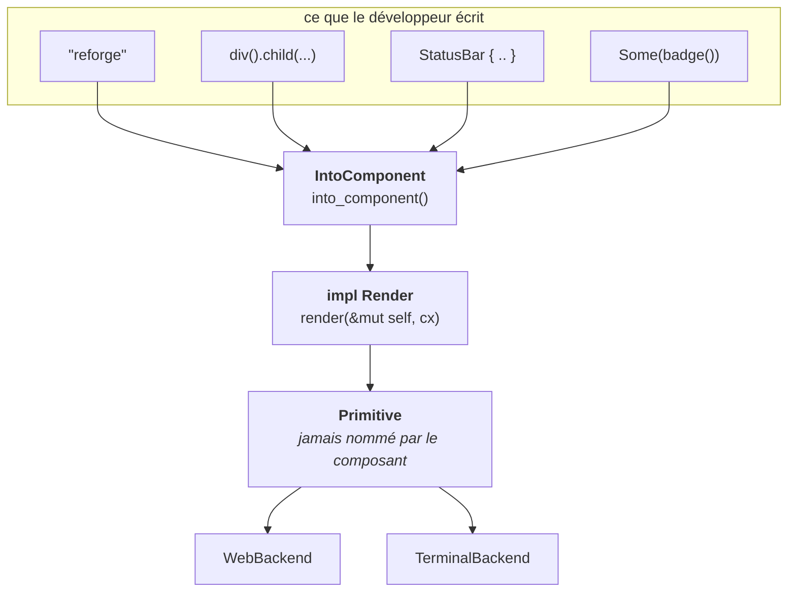

Le premier article a posé les trois couches primordiales d'un framework UI réactif : la mémoire et le contexte, l'arbre de descripteurs, le backend. Nous allons dès à présent introduire les premières lignes de notre propre framework que nous appelerons `Reforge`.

Cette étape est l'une des plus structurante car elle introduit directement la DX du framework : **la signature de la méthode qu'un développeur écrit quand il écrit un composant.**

Afin d'obtenir la signature la plus propre et agréable à écrire pour nos utilisteurs, nous allons partir de la version la plus naïve qui puisse fonctionner ensuite nous nous en servons, nous constatons ce qui coince, puis nous corrigeons. Ces quatre étapes sont chacune motivée par un problème que la précédente a introduite.

En finalité de cet étape de conception, la signature ressemblera à celle-ci

```rust [renderer.rs]
pub trait Render {
    fn render(&mut self, cx: &mut Context) -> impl IntoComponent;
}
```

---

## Retourner directement le descripteur de chaque composant

Dans le premier article, nous avons conclus qu'un composant décrivait une UI.
Cette description, dans notre architecture s'appelle une `Primitive`, elle représente une donnée inerte, sans comportement, que le futur backend sera en capacité de consommer.

```rust
/// Le descripteur bas niveau produit par une passe de rendu.
pub enum Primitive {
    Element(ElementNode),
    Text(TextNode),
    Empty,
}
```

Dans notre enum il existe à ce jour trois variants, et rien d'autre.

Un `ElementNode` est une boîte stylée qui porte une liste d'enfants, un `TextNode` est une suite de caractères avec sa typographie, et `Empty` représente ce qui ne se peint pas. Aucun des trois ne contient de closure, de pointeur de fonction ou de référence vers le moteur, c'est ce qui permet à un backend de consommer cet arbre sans rien savoir de la façon dont il a été produit.

Puisqu'un composant doit produire cette description, la traduction la plus directe possible tient sur une ligne :

```rust [renderer.rs]
pub trait Render {
    fn render(&self) -> Primitive;
}
```

Un trait, une méthode, pas de paramètre de type, pas de lifetime. À ce stade, rien ne semble pouvoir mal tourner : le composant reçoit un accès à ses propres données et retourne ce que le moteur attend.

Le problème n'apparaît qu'à l'usage. Écrivons donc un composant réaliste, une barre de statut qui affiche un libellé et un état de connexion, et regardons ce que le développeur est obligé de taper :

```rust [status_bar.rs]
struct StatusBar {
    connected: bool,
}

impl Render for StatusBar {
    fn render(&self) -> Primitive {
        Primitive::Element(ElementNode {
            id: Some("status-bar"),
            style: Style::DEFAULT,
            children: vec![
                Primitive::text("reforge"),
                Primitive::text(if self.connected { "online" } else { "offline" }),
            ],
        })
    }
}
```

Comptons ce qu'il a fallu savoir pour écrire ce composant.

1. `Primitive` est un enum et lequel de ses variants représente une boîte
2. Cette boîte s'appelle `ElementNode`, qu'elle a trois champs, et lesquels
3. Les enfants vivent dans un `Vec`
4. Le style ne peut pas être omis et qu'il existe une constante pour le neutre.

Cela fait cinq détails d'implémentation du moteur exposés dans le tout premier composant venu.

La conséquence pratique est brutale. Ajouter un champ à `ElementNode`, ne serait-ce qu'un booléen avec une valeur par défaut évidente, casse la compilation de tous les composants écrits jusqu'à présent, y compris ceux qui ne se soucient pas de ce champ.

La couche censée être une frontière est devenue un formulaire à remplir, et un formulaire dont le moteur ne peut plus changer la mise en page.

Et ce n'est pas seulement une question de maintenance. Écrire une interface de cette façon est pénible due aux deux niveaux d'imbrication pour une barre à deux enfants, un `vec!` pour ce qui devrait être une suite d'appels, et pas la moindre place pour poser un style sans construire un `Style` complet à la main.

Retenons le premier symptôme : **le composant en sait trop sur ce qu'il produit.**

---

## Donner au composant son identité et son contexte

Deuxième problème fondamental et davantage immédiat. Un composant doit pouvoir muter pendant qu'il rend, et surtout, il doit pouvoir situer sa place au sein de l'arbre. Avec `&self` et rien d'autre, il n'a accès ni à son identité, ni à son parent, ni à quoi que ce soit qui survive à l'appel.

Nous passons donc deux choses : un accès mutable à soi-même, et un contexte de rendu.

```rust
pub trait Render {
    fn render(&mut self, cx: &mut Context) -> Primitive;
}
```

`&mut self` permet à un composant de mettre à jour son propre état pendant la passe, sans cellule partagée ni indirection.

`cx: &mut Context` est le curseur emprunté sur le moteur. À ce stade de la série, il sait deux choses : quelle identité rend actuellement, et comment descendre chez un enfant sous une identité neuve.

```rust
impl Context<'_> {
    /// Rend un enfant sous une identité fraîche.
    pub fn render_child(&mut self, child: &mut impl Render) -> Primitive {
        let parent = self.current;

        self.current = self.runtime.allocate_id();
        let primitive = child.render(self);
        self.current = parent;

        primitive
    }
}
```

Le contexte est reborrowé, jamais reconstruit : descendre coûte une écriture de champ à l'aller et une au retour. C'est ce `ComponentId` alloué ici qui portera, dans le prochain article, la mémoire persistante et les abonnements aux signaux.

Cette étape apporte un véritable gain, cependant elle ne corrige pas le premier symptôme. Le composant remplit toujours un `ElementNode` à la main.

---

## Écrire la vue avec des builders

On ne va pas se mentir, Rédiger nous-même les `ElementNode` littéral est indigeste et extrêmement fatiguant à la longue. Nous introduisons donc un élément qui se construit par chaînage, `Div`, avec sa fonction libre en suivant un pattern builder

```rust
let view = div()
    .id("status-bar")
    .flex_row()
    .items_center()
    .child("reforge")
    .child("online");
```

Il est important de noter que le composant `Div` n'est pas une `Primitive` mais un builder qui stocke ses enfants sans les évaluer. La conversion vers le descripteur se fait au moment du rendu. `Div` implémente donc `Render`, et notre composant devient celui-ci

```rust [status_bar.rs]
impl Render for StatusBar {
    fn render(&mut self, cx: &mut Context) -> Primitive {
        div()
            .id("status-bar")
            .flex_row()
            .items_center()
            .child("reforge")
            .child(if self.connected { "online" } else { "offline" })
            .render(cx)
    }
}
```

Stop, arrêtez-vous ici et respirez, observez et admirez cette dernière ligne. `.render(cx)`.

Elle est présente dans chaque composant du framework, sans aucune exception sans rien apporter d'utile. Le développeur a décrit sa vue, puis il doit expliquer au moteur comment la transformer en la chose que le moteur voulait de toute façon. C'est un procédé qui se trouve-être non pertinent, il faut donc que nous trouvions le moyen d'écrire un composant `Div` sans appeler explicitement la méthode `.render(cx)` qui se trouve-être une erreur de type, donc le compilateur nous fusille du regard et nous rattrape sur une faute que la signature nous a forcés à commettre.

Pire, la composition en souffre. Imbriquer un composant dans un autre demande la même incantation :

```rust
struct Page {
    header: Header,
    status: StatusBar,
}

impl Render for Page {
    fn render(&mut self, cx: &mut Context) -> Primitive {
        div()
            .child(self.header.render(cx))   // ✗ ne compile pas :
            .child(self.status.render(cx))   //   un Primitive n'est pas un enfant
            .render(cx)
    }
}
```

Le problème devient véritablement visible lorsque nous avons le besoin d'associer plusieurs composants les uns dans les autres. Un composant `Primitive` est le *résultat* du moteur, aucunement un matériau de construction. Passer d'une `Primitive` à `.child()` reviendrait à recoller un morceau déjà traité dans une fonction gérant lui-même la transformation, et cela nous obligerait à considérer une `Primitive` comme étant lui-même un `Render` et ainsi d'autoriser les composants à fabriquer des descripteurs à la main. Nous serions revenus à la première tentative par la petite porte.

Le véritable diagnostic est celui qui déclenche l'étape suivante : **le type de retour est faux.** Un composant ne veut pas produire un descripteur. Il veut produire *quelque chose qui sait devenir un nœud*, et laisser le moteur décider quand et comment.

---

## Déplacer la conversion dans le type de retour

Nous introduisons un trait dont la seule responsabilité est la conversion.

```rust
/// Tout ce qui est capable de devenir un nœud de l'arbre.
pub trait IntoComponent {
    /// Le composant concret produit par la conversion.
    type Component: Render;

    fn into_component(self) -> Self::Component;
}
```

Par la suite nous l'implémentons pour tout ce qu'un développeur a envie d'écrire dans une vue.

```rust
/// Un élément est déjà un composant : la conversion est l'identité.
impl IntoComponent for Div {
    type Component = Self;

    fn into_component(self) -> Self {
        self
    }
}

/// Un libellé constant devient un nœud de texte.
impl IntoComponent for &'static str {
    type Component = Text;

    fn into_component(self) -> Text {
        text(self)
    }
}

/// Une branche absente devient un nœud vide, pas un trou dans l'arbre.
impl<T: IntoComponent> IntoComponent for Option<T> {
    type Component = Option<T::Component>;

    fn into_component(self) -> Self::Component {
        self.map(IntoComponent::into_component)
    }
}
```

Le trait de rendu peut alors retourner un type opaque :

```rust
pub trait Render {
    fn render(&mut self, cx: &mut Context) -> impl IntoComponent;
}
```

En instaurant le trait `IntoComponent` le composant redevient une description, et rien d'autre :

```rust
impl Render for StatusBar {
    fn render(&mut self, _: &mut Context) -> impl IntoComponent {
        div()
            .id("status-bar")
            .flex_row()
            .items_center()
            .child("reforge")
            .child(if self.connected { "online" } else { "offline" })
    }
}
```

Le `.render(cx)` anciennement présent en dernière position est maintenant porté disparu. Le terme de `Primitive` également, il n'apparaît plus une seule fois dans le code que le développeur écrit. La frontière annoncée dans le premier article est enfin réelle, et pas seulement documentée.

La composition redevient triviale, parce que le composant enfant est un matériau et non un résultat

```rust
impl Render for Page {
    fn render(&mut self, _: &mut Context) -> impl IntoComponent {
        div()
            .flex_col()
            .child(&mut self.header)
            .child(&mut self.status)
    }
}
```

C'est `.child()` qui accepte désormais tout composant implémentant le trait `IntoComponent`, et c'est le moteur qui en descendant dans l'arbre, appelle `into_component`, alloue une identité et déclenche le rendu. Le développeur n'orchestre plus rien.

Le trajet complet d'une valeur, de ce qui est écrit à ce qui est peint :



---

## Ce que ce type de retour opaque coûte

Il serait malhonnête de s'arrêter sur cette victoire. En effet `impl Trait` en position de retour dans un trait et stabilisé dans Rust 1.75, a une conséquence directe : **le trait cesse d'être compatible avec `dyn`** et `Box<dyn Render>` ne compile plus, parce que le compilateur ne connaît pas la taille du type retourné derrière la vtable.

Or nous avons besoin d'effectuer un effacement de type. Un conteneur est hétérogène par nature alors qu'un composant `Div` peut possèder un libellé, un autre `Div` et un composant métier dans la même liste d'enfants, et aucun type unique ne décrit ces différences.

La sortie est de restaurer l'effacement à un seul endroit, dans un trait miroir que le moteur utilise et que le développeur ne voit jamais

```rust
/// Version effaçable de [`Render`], utilisée par les listes d'enfants.
pub trait AnyComponent {
    fn render_any(&mut self, cx: &mut Context) -> Primitive;
}

/// Tout composant statique en fournit une version dynamique sans coût supplémentaire.
impl<R: Render> AnyComponent for R {
    fn render_any(&mut self, cx: &mut Context) -> Primitive {
        let mut component = self.render(cx).into_component();
        cx.render_child(&mut component)
    }
}
```

Les enfants sont maintenant stockés en `Box<dyn AnyComponent>` mais jamais en `Box<dyn Render>`. Le développeur écrit du code entièrement monomorphisé, et l'unique frontière d'effacement se trouve à l'endroit où une valeur entre dans une liste hétérogène.

D'abord, un type de retour opaque interdit deux branches de types différents dans un même `render`. Écrire `if condition { div() } else { text("...") }` ne compile pas, exactement comme pour n'importe quel `impl Trait`. La réponse idiomatique est de passer par `Option`, ou d'unifier en un `Div` qui contient l'une ou l'autre branche, et c'est une contrainte que le développeur rencontrera dès son troisième composant.

Ensuite, les messages d'erreur d'un type opaque sont moins directs que ceux d'un type nommé. Quand une chaîne fluente ne compile pas au milieu d'un `impl IntoComponent`, le compilateur parle d'un type qu'il ne peut pas afficher. C'est le prix de la disparition du `.render(cx)`, et je le trouve largement payant, mais c'est un prix.

---

## Où nous en sommes

Nous avons une signature, obtenue en quatre corrections plutôt qu'en une révélation :

| Étape | Signature | Ce qu'elle a réglé |
|---|---|---|
| Descripteur direct | `fn render(&self) -> Primitive` | rien, mais elle expose le problème |
| Identité et contexte | `fn render(&mut self, cx: &mut Context) -> Primitive` | l'identité et l'état local |
| Builders | idem, avec `div()` et le chaînage | l'ergonomie d'écriture, pas la frontière |
| Conversion différée | `fn render(&mut self, cx: &mut Context) -> impl IntoComponent` | la frontière, et la composition |

Un seul trait à implémenter, aucune macro, et un composant qui ne nomme plus jamais les structures internes du moteur.

Le `Context` distribue des identités, mais il ne se souvient de rien pour le moment et passe à l'autre, aucun composant ne peut réagir à quoi que ce soit.

Le prochain article branche la mémoire sur ces identités : les signaux, le suivi automatique des lectures pendant une passe, et la file des composants à réexécuter. C'est le moment où `ComponentId` cesse d'être un compteur pour devenir une adresse.
