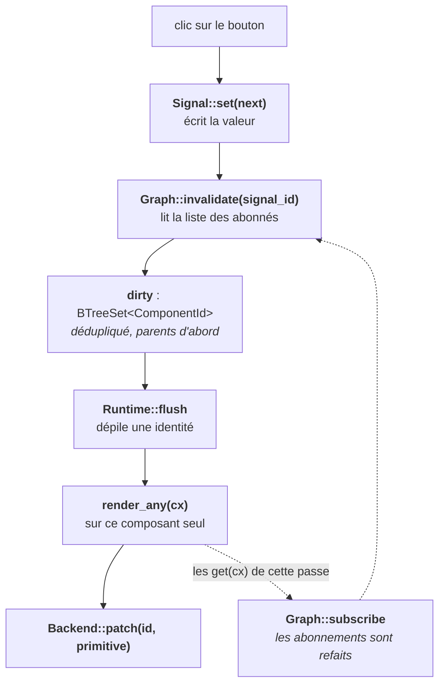

## Un arbre correct, et complètement inerte

À la fin du précédent article, nous avons un trait de rendu propre : un composant produit un `impl IntoComponent`, ne nomme jamais les structures internes du moteur, et se compose sans cérémonie. Le `Context` descend dans l'arbre en distribuant un `ComponentId` à chaque nœud.

Et il ne se passe rien de plus. Ces identités sont amnésiques : le moteur les alloue, les oublie, et en alloue de nouvelles à la passe suivante. Aucun composant ne peut se souvenir de quoi que ce soit, donc aucun n'est en capacité de changer.

Cet article corrige ce manquement grâce à la même méthodologie que le précédent sujet qu'était l'arbre de composant, nous allons prendre le problème dans sa forme la plus simple, nous le résolverons, nous regardons ce que la solution a cassé, et nous continuons.

::::step-group
  :::step{title="Se souvenir"}
    Un composant doit retrouver, à la passe *n+1*, la valeur qu'il a posée à la passe *n*.
  :::

  :::step{title="Notifier"}
    Modifier cette valeur doit prévenir le moteur, sans que le développeur ait à le faire à la main.
  :::
  
   :::step{title="Cibler"}
    Le moteur doit réexécuter les composants concernés et uniquement eux.
  :::
::::

---

## Où poser l'état, puisque `render` se termine

Commençons par la solution évidente, une propriété contenue dans la structure du composant.

```rust [counter.rs]
struct Counter {
    count: u32,
}

impl Render for Counter {
    fn render(&mut self, _: &mut Context) -> impl IntoComponent {
        div().child(self.count)
    }
}
```

La méthode `render` prend `&mut self`, donc le composant peut modifier sa propre propriété. Pour un composant que l'appelant garde en vie d'une frame à l'autre, cela suffirait.

Le problème apparaît dès que ce composant est construit par son parent, prenons un exemple type récurrent

```rust [page.rs]
impl Render for Page {
    fn render(&mut self, _: &mut Context) -> impl IntoComponent {
        div().child(Counter { count: 0 })
    }
}
```

Ce composant `Counter` naît et meurt à l'intérieur de la passe de `Page`. Sa propriété `count` repart de zéro à chaque frame, et rien dans le système de types ne signale l'anomalie puisqu'en réalité c'est un comportement tout a fait ordinaire. La durée de vie de l'état est celle de la valeur qui le porte, alors qu'elle devrait être celle de la *position dans l'arbre*.

Cependant nous avons de la chance (ou du talent) puisque nous avons déjà un nom pour cette position, en effet il s'agit du `ComponentId`. Il suffit d'accrocher la mémoire dessus, dans **le runtime** plutôt que dans **le composant**.

```rust [runtime.rs]
pub struct Runtime {
    next_id: u32,
    /// Les cellules d'état de chaque composant, dans l'ordre de déclaration.
    states: HashMap<ComponentId, Vec<Box<dyn Any>>>,
}
```

Le `Vec<T>` par composant et l'effacement en `Box<dyn Any>` méritent une explication chacun. Un composant peut déclarer plusieurs états, de types différents, et le runtime ne connaît aucun de ces types : `dyn Any` est la seule façon de les ranger côte à côte. Le `Box` suffit parce que le runtime est seul propriétaire de ce conteneur ; ce qu'il rend au composant n'est pas le conteneur mais une copie du handle qu'il contient, et c'est ce handle qui portera le partage.

Le `Context` expose alors la déclaration d'une cellule, en gardant un curseur sur les slots du composant courant :

```rust [context.rs]
pub struct Context<'a> {
    runtime: &'a mut Runtime,
    /// Le composant en train de rendre.
    current: ComponentId,
    /// Le prochain slot d'état à distribuer à ce composant.
    cursor: usize,
}

// [!code ++:9]
impl Context<'_> {
    /// Déclare, ou retrouve, le signal suivant de ce composant.
    pub fn use_signal<T: 'static>(&mut self, init: impl FnOnce() -> T) -> Signal<T> {
        let slot = self.cursor;
        self.cursor += 1;

        self.runtime.state_at(self.current, slot, init)
    }
}
```

Et le runtime crée la cellule à la première passe, la retrouve aux suivantes :

```rust [runtime.rs]
pub struct Runtime {
    next_id: u32,
    states: HashMap<ComponentId, Vec<Box<dyn Any>>>,
}

// [!code ++:19]
impl Runtime {
    fn state_at<T: 'static>(
        &mut self,
        owner: ComponentId,
        slot: usize,
        init: impl FnOnce() -> T,
    ) -> Signal<T> {
        let slots = self.states.entry(owner).or_default();

        if slot == slots.len() {
            slots.push(Box::new(Signal::new(init())));
        }

        slots[slot]
            .downcast_ref::<Signal<T>>()
            .expect("le type d'un slot ne change pas d'une passe à l'autre")
            .clone()
    }
}
```

L'identité d'une cellule est donc son rang d'appel, c'est d'ailleurs exactement le même fonctionnement des hooks de React dont nous parlions dans le premier article. Nous héritons de la même règle : un `use_signal` placé dans une condition décale tous les suivants, et aucune information de compilation ne permet de le détecter. Le `expect` ci-dessus est la sanction, à l'exécution.

> Nous savons nous souvenir. Nous ne savons toujours pas réagir.

---

## Faire en sorte qu'une écriture prévienne le moteur

Une cellule qui se contente de stocker ne sert à rien : modifier sa valeur ne déclencherait aucun rendu. Ce qui manque est le lien entre l'écriture et le moteur, et c'est tout le rôle du `Signal`.

```rust [signal.rs]
pub struct Signal<T> {
    id: SignalId,
    value: Rc<RefCell<T>>,
    graph: Rc<RefCell<Graph>>,
}
```

Trois champs, trois responsabilités. `id` identifie la cellule dans le graphe de dépendances. `value` porte la donnée, derrière un `Rc<RefCell<T>>` puisque plusieurs closures d'événement voudront la manipuler. `graph` est la partie partagée du runtime, celle qui enregistre qui lit quoi et qui doit être réexécuté.

Une première version naïve de l'écriture ressemblerait à ceci :

```rust [signal.rs]
pub struct Signal<T> {
    id: SignalId,
    value: Rc<RefCell<T>>,
    graph: Rc<RefCell<Graph>>,
}

// [!code ++:6]
impl<T> Signal<T> {
    pub fn set(&self, next: T) {
        *self.value.borrow_mut() = next;
        self.graph.borrow_mut().invalidate_everything(); // ✗
    }
}
```

Notre signaling est maintenant fonctionnel et c'est exactement ce que nous refusions dans le premier article. Invalider tout l'arbre à chaque écriture revient à réintroduire le balayage global que le modèle par signaux existe précisément pour éviter.

Pour invalider peu le moins de code possible, le graphe doit savoir *qui* a lu la valeur. Ccette information, personne ne va et **ne doit** la déclarer à la main.

---

## Observer les lectures plutôt que déclarer les dépendances

Voici le point central de tout l'article, et il tient dans une méthode.

```rust [signal.rs]
pub struct Signal<T> {
    id: SignalId,
    value: Rc<RefCell<T>>,
    graph: Rc<RefCell<Graph>>,
}

// [!code ++:7]
impl<T: Clone> Signal<T> {
    /// Lecture suivie : le composant qui lit devient un abonné.
    pub fn get(&self, cx: &mut Context) -> T {
        self.graph.borrow_mut().subscribe(self.id, cx.id());
        self.value.borrow().clone()
    }
}
```

Le développeur écrit `count.get(cx)` parce qu'il souhaite accéder à la valeur. L'abonnement est un effet de bord de cette lecture, et il n'apparaît nulle part dans son code. Le `cx` n'est pas non plus là pour décorer, il a un rôle simple; c'est lui qui porte l'identité du composant en train de rendre ainsi c'est lui qui rend l'abonnement possible sans pile globale ni variable de thread.

Le graphe, lui, n'est un simple index

```rust [graph.rs]
#[derive(Default)]
struct Graph {
    /// Pour chaque signal, les composants qui l'ont lu.
    subscribers: HashMap<SignalId, HashSet<ComponentId>>,
    /// Les composants à réexécuter, dédupliqués et triés par identité.
    dirty: BTreeSet<ComponentId>,
}

impl Graph {
    fn subscribe(&mut self, signal: SignalId, reader: ComponentId) {
        self.subscribers.entry(signal).or_default().insert(reader);
    }

    fn invalidate(&mut self, signal: SignalId) {
        if let Some(readers) = self.subscribers.get(&signal) {
            self.dirty.extend(readers);
        }
    }
}
```

L'écriture devient alors chirurgicale, et surtout elle n'a plus besoin de `Context` :

```rust [signal.rs]
pub struct Signal<T> {
  id: SignalId,
  value: Rc<RefCell<T>>,
  graph: Rc<RefCell<Graph>>,
}

impl<T> Signal<T> {
  pub fn set(&self, next: T) {
      *self.value.borrow_mut() = next;
      self.graph.borrow_mut().invalidate_everything(); // [!code --]
      self.graph.borrow_mut().invalidate(self.id); // [!code ++]
  }
  
  // [!code ++:4]
  pub fn update(&self, edit: impl FnOnce(&mut T)) {
      edit(&mut self.value.borrow_mut());
      self.graph.borrow_mut().invalidate(self.id);
  }
}
```

Cette asymétrie est souhaité, lorsqu'une lecture a lieu pendant une passe de rendu, où un `Context` existe. Une écriture a lieu dans un gestionnaire d'événement, longtemps après au moment où il n'y en a plus. Exiger un `cx` dans `set` obligerait à faire vivre le contexte au-delà du rendu, ce qui est précisément ce que son emprunt interdit.

Une dépendance conditionnelle reste juste. Si une branche n'est pas prise pendant la passe, le signal qu'elle lisait n'est pas suivi ce tour-là, parce que `get` n'a pas été appelé.

Un composant qui ne lit aucun signal n'apparaît dans aucun `HashSet`, donc rien ne peut jamais le marquer. Il devient « rendu une seule fois » à l'instar de `RenderOnce` proposé par GPUI par conséquence mécanique, sans qu'aucun trait ni aucune annotation ait eu à le déclarer. C'est la promesse du premier article, tenue ici en simplement trois lignes de code.

---

## Ne réexécuter que ce qui est marqué

Reste à vider la file. Le runtime tient les composants montés, indexés par la même identité que les états et les abonnements :

```rust
pub struct Runtime {
    next_id: u32,
    states: HashMap<ComponentId, Vec<Box<dyn Any>>>,
}

impl Runtime {
    // [!code ++:18]
    /// Réexécute les composants marqués, jusqu'à ce que la file soit vide.
    pub fn flush(&mut self, backend: &mut impl Backend) {
        while let Some(id) = self.next_dirty() {
            let Some(mut component) = self.components.remove(&id) else {
                continue; // le composant a été démonté entre-temps
            };
      
            let mut cx = Context::new(self, id);
            let primitive = component.render_any(&mut cx);
      
            self.components.insert(id, component);
            backend.patch(id, &primitive);
        }
    }
  
    fn next_dirty(&mut self) -> Option<ComponentId> {
        self.graph.borrow_mut().dirty.pop_first()
    }
}
```

Trois détails de cette boucle portent des décisions.

Le composant est retiré de la table avant d'être rendu, puis remis. C'est la façon la plus simple d'obtenir un `&mut` sur lui tout en passant un `&mut Runtime` au `Context`, sans se battre avec le borrow checker ni ajouter d'indirection.

La file est un `BTreeSet`, ce qui apporte deux éléments d'un coup.

- La déduplication : un composant marqué trois fois pendant la même frame ne rend qu'une fois
- Un ordre stable par identité croissante : comme les identités sont allouées en descente, un parent porte un identifiant plus petit que ses enfants, donc les parents passent d'abord.

Enfin, la propagation s'arrête d'elle-même, réexécuter un composant ne réexécute pas ses enfants ainsi le moteur les retrouve par leurs ancrages et ne redescend que si le rendu du parent le demande. Un enfant qui ne lit pas le signal modifié n'est jamais marqué, donc jamais réexécuté, même si son parent vient de l'être.



La flèche en pointillés est celle que nous oublions en lisant le mécanisme trop vite : chaque réexécution reconstruit les abonnements du composant. C'est ce qui permet aux dépendances de suivre les branches conditionnelles au lieu de rester figées sur celles de la première passe.

---

## Un compteur, en entier

```rust
struct Counter;

impl Render for Counter {
    fn render(&mut self, cx: &mut Context) -> impl IntoComponent {
        let count = cx.use_signal(|| 0);

        div()
            .flex_row()
            .items_center()
            .gap(8.0)
            .child(count.get(cx))
            .child(
                button("incrémenter")
                  .on_click(|_| count.update(|n| *n += 1))
            )
    }
}
```

Le signal `count` est déclaré par position : c'est la première cellule de ce composant, et elle sera retrouvée telle quelle à toutes les passes suivantes.

`count.get(cx)` fait deux choses en une : il rend la valeur à afficher, et il inscrit ce `Counter` dans les abonnés du signal. Rien dans le code ne dit « ce composant dépend de count ».

La closure du `use_signal` mérite un mot, parce qu'elle surprend en venant de Vue ou de Solid, où `ref(0)` s'écrit sans problème.

Ces frameworks séparent deux phases. Le `setup` de Vue s'exécute une seule fois par instance, et c'est là que vivent les déclarations ; seule la fonction de rendu se rejoue ensuite. Solid va plus loin encore, avec un corps de composant qui ne tourne qu'une fois, comme nous le montrions dans le premier article.

Reforge n'a qu'une phase. `render` est à la fois l'endroit où nous déclarons et celui qui se réexécute, exactement comme un composant fonction React. Une valeur passée directement serait donc construite à chaque passe pour être jetée dans toutes sauf la première, ce qui ne coûte rien sur un `0` mais peut devenir absurde sur un `Vec::with_capacity(1024)` ou un clone de chaîne. La closure repousse la construction à l'intérieur du `if slot == slots.len()`, donc au montage seulement. C'est le couple habituel de la bibliothèque standard, `unwrap_or` face à `unwrap_or_else`.

Cette petite gêne d'écriture est donc la conséquence directe du choix de granularité fait au début de la série : nous réexécutons le composant qui a lu le signal, pas l'expression qui l'a lu. Vue et Solid réexécutent moins, donc ils peuvent se permettre une déclaration qui ne tourne qu'une fois. React, dont le corps se rejoue comme le nôtre, documente d'ailleurs la même forme paresseuse.

Le `count.clone()` avant la closure est le prix du modèle. `Signal<T>` est `Clone` mais pas `Copy`, parce qu'il porte des `Rc`, et une closure `'static` doit posséder ce qu'elle capture. C'est une ligne de bruit par gestionnaire d'événement, et je la préfère à la gestion manuelle de la durée de vie qu'exigerait un handle `Copy` indexé dans une arène.

---

## Ce que ce mécanisme coûte

Trois points, dont deux sont des dettes assumées.

**Les abonnements fuient si personne ne les nettoie.** Quand un composant disparaît de l'arbre, son identité reste dans les `HashSet` de tous les signaux qu'il avait lus. Le moteur marquerait donc éternellement un composant qui n'existe plus, et le `HashMap` d'états garderait sa mémoire vivante. Le démontage doit balayer les trois structures :

```rust
impl Runtime {
    fn unmount(&mut self, id: ComponentId) {
        self.states.remove(&id);
        self.components.remove(&id);

        let mut graph = self.graph.borrow_mut();
        graph.dirty.remove(&id);
        for readers in graph.subscribers.values_mut() {
            readers.remove(&id);
        }
    }
}
```

Il nous reste à appeler cette méthode. Un composant ne disparaît jamais de lui-même : il disparaît parce que la passe qui le produisait ne le produit plus, typiquement une branche conditionnelle qui bascule ou un élément retiré d'une liste. L'appelant est donc la réexécution elle-même.

Pour le détecter, le runtime retient les identités allouées sous chaque composant, dans un champ `children: HashMap<ComponentId, Vec<ComponentId>>` que `Context::render_child` remplit au fil de la descente. La boucle de `flush` compare alors l'avant et l'après :

```rust [runtime.rs]
pub fn flush(&mut self, backend: &mut impl Backend) {
    while let Some(id) = self.next_dirty() {
        let Some(mut component) = self.components.remove(&id) else {
            continue;
        };

        // [!code ++:2]
        // Les enfants produits à la passe précédente.
        let previous = self.children.remove(&id).unwrap_or_default();

        let mut cx = Context::new(self, id);
        let primitive = component.render_any(&mut cx);
        self.components.insert(id, component);

        // [!code ++:5]
        // Ceux que la nouvelle passe n'a pas reproduits n'existent plus.
        let current = self.children.get(&id).cloned().unwrap_or_default();
        for gone in previous.iter().filter(|child| !current.contains(child)) {
            self.unmount(*gone);
        }

        backend.patch(id, &primitive);
    }
}
```

Le démontage est donc récursif par construction : `unmount` retire l'identité disparue, et comme ses propres enfants figurent dans `children`, la même comparaison les emporte au tour suivant.

Cette mécanique repose sur une hypothèse que nous n'avons pas encore justifiée : un composant doit conserver le **même** `ComponentId` d'une passe à l'autre, sinon la comparaison ne trouverait jamais deux identités égales et `use_signal` ne retrouverait jamais son slot. Une identité ne peut donc pas venir d'un simple compteur croissant, elle doit se déduire de la position dans l'arbre, c'est-à-dire du parent et du rang de l'enfant. C'est exactement le point sur lequel les listes dynamiques deviennent difficiles, puisque insérer un élément au milieu décale le rang de tous les suivants, et nous y reviendrons quand il faudra les traiter.

Cette boucle parcourt tous les signaux du programme pour retirer une seule identité, ce qui est acceptable tant que les démontages sont rares et le graphe petit. La correction connue est un index inverse, du `ComponentId` vers les signaux qu'il a lus, au prix d'une seconde structure à maintenir en cohérence à chaque `subscribe`. Nous ne la paierons que lorsqu'une liste dynamique la rendra nécessaire.

**Le coût d'indirection est réel.** Chaque lecture traverse un `Rc`, un `RefCell` et un `HashMap`, là où un handle indexé dans une arène partagée serait un accès direct dans un `Vec`, et serait `Copy` par-dessus le marché. Le compromis inverse est la libération automatique : ici, un signal dont plus personne ne détient de handle disparaît tout seul, alors qu'une arène demande de le retirer à la main et transforme un identifiant périmé en bug silencieux. Pour cette étape de la série, la sécurité vaut mieux que l'indirection économisée.

**Un signal est affine à son thread, et c'est la norme.** `Rc` et `RefCell` rendent `Signal<T>` non `Send`, donc il ne traverse pas une frontière de thread. Formulé ainsi cela sonne comme une limite sévère, alors que le rendu parallèle n'a jamais été sur la table : dans un navigateur le DOM n'est accessible que depuis le thread principal, et dans un terminal écrire sur un descripteur de fichier ne gagne rien à être parallélisé. Aucun de nos deux backends ne saurait quoi faire d'un signal partageable.

Le fait d'être mono-threadé n'est pas une mauvaise chose, en effet l'UI est généralement elle-aussi mono-threadé par nature, [GPUI](https://github.com/zed-industries/zed/tree/main/crates/gpui) sépare explicitement deux exécuteurs, et leurs signatures disent tout : le [`BackgroundExecutor`](https://docs.rs/gpui/latest/gpui/struct.BackgroundExecutor.html) exige `Send` sur le futur comme sur son résultat, tandis que le [`ForegroundExecutor`](https://docs.rs/gpui/latest/gpui/struct.ForegroundExecutor.html) ne l'exige pas et vérifie à l'exécution que le futur n'est interrogé que depuis le thread qui l'a lancé. Un éditeur de code expédié en production tient donc son état d'interface sur un seul thread, exactement comme nous.

Ce qui reste à notre charge est la frontière, non pas le parallélisme. Un travail de fond, requête réseau ou lecture de fichier, s'exécute sur un autre thread et doit revenir explicitement dans le monde de l'interface pour écrire dans un signal. GPUI donne là aussi la bonne forme : son [`AsyncApp`](https://docs.rs/gpui/latest/gpui/struct.AsyncApp.html) est un handle détenu, conservable à travers un `await`, dont toutes les méthodes rendent un `Result` parce qu'il ne tient qu'une référence faible sur l'application. Ce `Result` n'est pas une précaution timide, il enregistre un fait : la réponse peut arriver après que l'utilisateur a fermé la vue qui l'attendait. C'est le mécanisme qu'il nous faudra construire quand la série abordera l'asynchrone.

---

## Où nous en sommes

La réactivité tient en deux idées qui se rejoignent. Le `ComponentId` donne une adresse stable à un nœud de l'arbre, et `Signal::get(cx)` transforme une lecture en abonnement à cette adresse. Tout le reste, la file, la déduplication, l'arrêt de la propagation, découle de ces deux-là.

Ce que le développeur écrit n'a pas bougé : `cx.use_signal(...)`, `.get(cx)`, `.set(...)`. Aucune macro, aucune annotation de dépendance, aucun trait supplémentaire à implémenter.

Il reste un manque évident. Un composant sait parler à lui-même, mais pas à ses descendants : passer une configuration, un thème ou un client d'API à travers dix niveaux d'arbre exige aujourd'hui de la faire transiter dans chaque constructeur intermédiaire.

Le prochain article s'attaque à cette question, l'injection de dépendances par le `Context`, pattern *provider*, et composants headless, c'est-à-dire des composants qui portent un comportement sans imposer la moindre décision de style.
